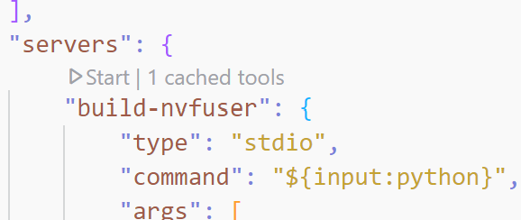
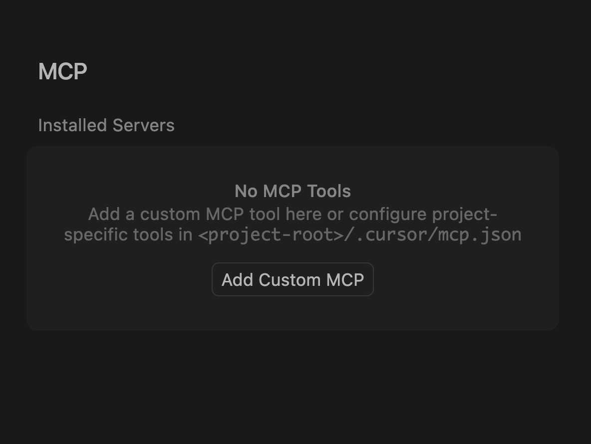
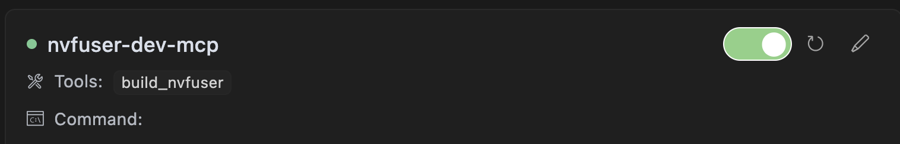

# Nvfuser Dev MCP Server

## How to use (VSCode version 1.99)

Keep the `mcp_server.py` file in place. Make sure `Fuser` is in your current workspace.

Merge content of `mcp_template.json` into `.vscode/mcp.json`.
It should look something like this:

```json
{
    "inputs": [
        {
            "id": "python",
            "type": "promptString",
            "description": "Full path to Python executable if using virtual environment, otherwise simply type \"python\"."
        }
    ],
    "servers": {
        "build-nvfuser": {
            "type": "stdio",
            "command": "${input:python}",
            "args": [
                "${workspaceFolder}/.github/mcp/mcp_server.py",
                "--python-path",
                "${input:python}"
            ],
            "env": {}
        }
    }
}
```

Then, VS Code may prompt you with this start button in `.vscode/mcp.json`, like this



Make sure to have `mcp` in your Python environment, otherwise `pip install mcp`.
Click the start button. VS Code will ask you for a python executable path.
If you use a python virtual environment, run `which python` in your terminal and paste the full path.
Otherwise, simply input `python`. Ensure the MCP server runs.
You can verify this by checking the list of tools in the Agent chat box.

You're good to go!

Here is an example to try:

- Fetch this commit that contains a build error: 1805c072c679a6694a04e4222a114471d9ce80e2
- Git checkout and clean up the workspace.
- In the Agent chat window, say "build nvfuser and fix any build error".
Approve MCP tool usage of `build_nvfuser`.
- Sit back and enjoy!

Want something more?
- Try letting the Agent debug a test failure! Say
```text
debug this test failure: `bin/test_nvfuser --gtest_filter="something"`
Make sure you build nvfuser every time you edit the source file.
```

We'll be adding more tools to run the entire test suite or individual tests, so stay tuned!

## How to use (Cursor)

To add a new MCP server in cursor, go to the command palette (`cmd + shift + P`) and search for "Open MCP Settings". In the MCP settings click on "Add new global MCP server":


You can then copy the content of [cursor_mcp_template.json](cursor_mcp_template.json). Update `"command": "python"` with the full `python` you want to use for running the server, and the same for `python` in the `args`.
Cursor will check the status of the server, if everything's fine you'll see something similar:


You're now ready to use the agent. Just open the Cursor chat tab (again `cmd + shift + P` and look for `Cursor: New Chat Tab`). Cursor will automatically recognize the new server. You can ask `build nvfuser and fix any build error`. Cursor will run the script. If the build fails, it will summarize the errors. if you re-ask again `build nvfuser and fix any build error`, Cursor will start fixing the errors and trying to build `nvfuser`.
