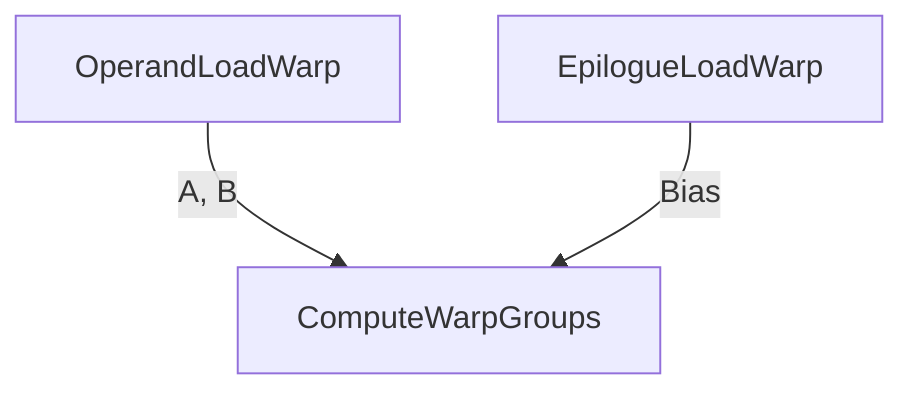
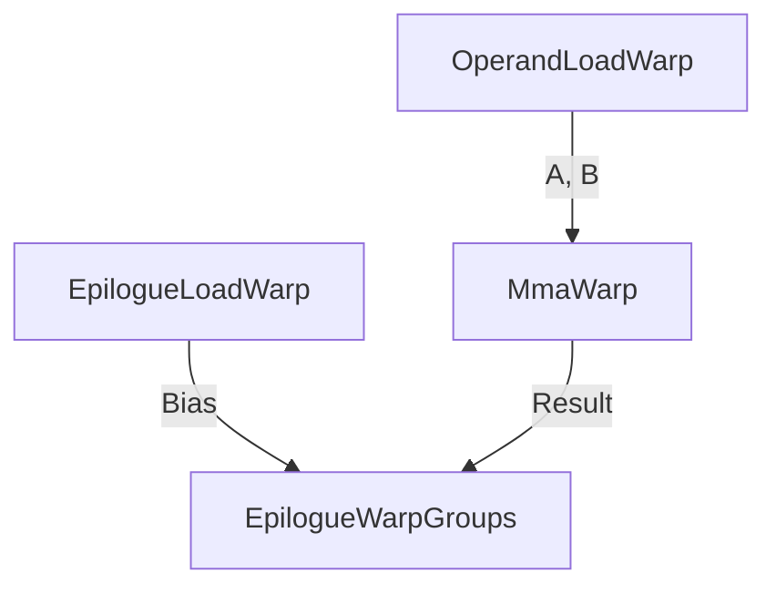
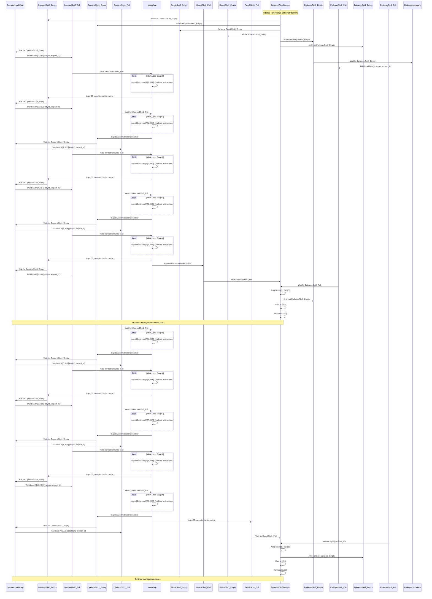

# Multi-Role Warp Specialization Plan for Blackwell MMA

## Table of Contents
- [Overview](#overview)
- [Current Architecture](#current-architecture)
  - [Hopper Architecture (Current)](#hopper-architecture-current)
- [Planned Architecture](#planned-architecture)
  - [Blackwell Architecture (Target)](#blackwell-architecture-target)
  - [Example: Fused Multiply-Sum with Epilogue](#example-fused-multiply-sum-with-epilogue)
  - [Warp Dependency Diagrams](#warp-dependency-diagrams)
  - [Sequence Diagrams](#sequence-diagrams)
    - [Hopper Single-Role Warp Specialization](#sequence-diagram-hopper-single-role-warp-specialization)
    - [Blackwell Multi-Role Warp Specialization](#sequence-diagram-blackwell-multi-role-warp-specialization)
  - [Mbarrier Synchronization Problem](#mbarrier-synchronization-problem)
    - [Option 1: Separate Mbarriers with Explicit Polling](#option-1-separate-mbarriers-with-explicit-polling)
    - [Option 2: Single Mbarrier with Parity](#option-2-single-mbarrier-with-parity)
    - [Evidence from CUTLASS Implementation](#evidence-from-cutlass-implementation)
- [Key Design Changes](#key-design-changes)
  - [1. Scheduling Changes](#1-scheduling-changes)
  - [2. Circular Buffer Analysis Changes](#2-circular-buffer-analysis-changes)
  - [3. Circular Buffer Pass Changes](#3-circular-buffer-pass-changes)
  - [4. MBarrier Management Changes](#4-mbarrier-management-changes)
  - [5. Indexing and Synchronization Changes](#5-indexing-and-synchronization-changes)
- [Implementation Plan](#implementation-plan)
  - [Phase 1: Analysis and Detection](#phase-1-analysis-and-detection)
  - [Phase 1.5: Dependency DAG Analysis](#phase-15-dependency-dag-analysis)
  - [Phase 2: Code Generation](#phase-2-code-generation)
  - [Phase 2.5: Backward Compatibility](#phase-25-backward-compatibility)
  - [Phase 3: Synchronization](#phase-3-synchronization)
  - [Phase 4: Testing and Validation](#phase-4-testing-and-validation)
- [Key Technical Considerations](#key-technical-considerations)
  - [1. Async Operation Detection](#1-async-operation-detection)
  - [2. Stage Slice Position Compatibility](#2-stage-slice-position-compatibility)
  - [3. MBarrier Indexing](#3-mbarrier-indexing)
  - [4. Register Sharing](#4-register-sharing)
  - [5. Backward Compatibility](#5-backward-compatibility)
- [Code Locations to Modify](#code-locations-to-modify)
  - [Primary Files](#primary-files)
  - [Supporting Files](#supporting-files)
- [Testing Strategy](#testing-strategy)
  - [Unit Tests](#unit-tests)
  - [Integration Tests](#integration-tests)
- [Success Criteria](#success-criteria)
- [Conclusion](#conclusion)

## Overview

This document outlines the plan to extend nvFuser's circular buffering support to enable multi-role warp specialization for Blackwell MMA operations. The current system supports single-role warp specialization where one async warp handles TMA loads and compute warpgroups handle WgMMA and epilogue operations. For Blackwell, we need to support a second async warp (the "mma warp") that consumes the operand circular buffer populated by the first async warp (the "load warp").

## Current Architecture

### Hopper Architecture (Current)
- **AsyncWarp**: Handles TMA loads for operands
- **ComputeWarpGroups**: Handle WgMMA operations and epilogue computations
- **Circular Buffer Tensors**: Only operand tensors (A and B) are circular buffered in shared memory
- **Synchronization**: Uses mbarriers for each circular buffer slot:
  - **"Slot Empty" mbarrier**: Indicates slot is available for loading
  - **"Slot Full" mbarrier**: Indicates slot contains valid data for consumption
  - **AsyncWarp**: Waits for "slot empty" → issues TMA loads → arrives at "slot full"
  - **ComputeWarpGroups**: Wait for "slot full" → consume data → arrive at "slot empty"

## Planned Architecture

### Blackwell Architecture (Target)
- **LoadWarp**: Handles TMA loads for operands (first async warp)
- **MmaWarp**: Handles tcgen05 utcmma operations (second async warp)
- **EpilogueWarpGroups**: Handle epilogue computations only
- **Circular Buffer Tensors**:
  - Operand circular buffer tensors (A and B) - populated by LoadWarp, consumed by MmaWarp
  - MMA result circular buffer tensor - populated by MmaWarp, consumed by EpilogueWarpGroups
- **Synchronization**: Extended mbarriers for three-way synchronization:
  - **"Operand Slot Empty" mbarrier**: Indicates operand slot is available for loading
  - **"Operand Slot Full" mbarrier**: Indicates operand slot contains valid operands for MMA
  - **"Result Slot Empty" mbarrier**: Indicates result slot is available for MMA results
  - **"Result Slot Full" mbarrier**: Indicates result slot contains valid MMA results for epilogue
  - **LoadWarp**: Waits for "operand slot empty" → issues TMA loads → arrives at "operand slot full"
  - **MmaWarp**: Waits for "operand slot full" → issues tcgen05 utcmma → arrives at "result slot full"
  - **EpilogueWarpGroups**: Wait for "result slot full" → consume results → arrive at "result slot empty"

**Note**: The above describes a simple case with a single pipeline of chained circular buffers. In general, we might have multiple pipelines of chained circular buffers. For example, the epilogue warp group might also consume a circular buffer of epilogue inputs which is filled by another async warp. One of the key challenges to the analysis is:
1. **Grouping async operations and circular buffered tensors** into parts that can be computed by a single warp
2. **Determining the producer/consumer relationships** between the async warps and the epilogue compute warps
3. **Managing multiple circular buffer chains** that may have different synchronization requirements
4. **Building a dependency DAG** that represents all producer/consumer relationships and deriving mbarrier semantics from the graph structure

### Example: Fused Multiply-Sum with Epilogue

Consider a fusion that performs the following operations:
1. Load two bf16 operands (A and B) via TMA
2. Perform fusedMultiplySum(A, B) using WgMMA (Hopper) or tcgen05 utcmma (Blackwell)
3. Add the result to a 2D tensor (bias)
4. Cast the result back to bf16 for output

**Fusion Code Sample**:
```cpp
// Fusion definition
Fusion fusion;
FusionGuard fg(&fusion);

// Input tensors
auto tv0 = makeContigConcreteTensor({-1, 1, -1}, DataType::BFloat16);  // M, 1, K
auto tv1 = makeContigConcreteTensor({1, -1, -1}, DataType::BFloat16);  // 1, N, K
auto tv2 = makeContigConcreteTensor({-1, -1}, DataType::BFloat16);  // M, N (bias)
fusion.addInput(tv0);
fusion.addInput(tv1);
fusion.addInput(tv2);

// Operations - separate matmul, add, and cast
auto tv3 = fusedMultiplySum(tv0, tv1, {-1});  // WgMMA on Hopper, tcgen05 utcmma on Blackwell
auto tv4 = add(tv3, tv2);                      // Add bias
auto tv5 = castOp(DataType::BFloat16, tv4);    // Cast to bf16
fusion.addOutput(tv5);

// Scheduling: Split M and N dimensions by 128 to form CTA tiles
tv3->split(1, 256);
tv3->split(0, 128);
// Merge outer dimensions and split by 132 for persistent dimension
tv3->merge(0, 1);
tv3->split(0, 132);
// (not shown) propagate from mma result to all tensors

// Parallelize persistent dimension by BIDx (distributes across 132 CTAs)
tv0->axis(0)->parallelize(ParallelType::BIDx);
tv1->axis(0)->parallelize(ParallelType::BIDx);
tv2->axis(0)->parallelize(ParallelType::BIDx);
tv3->axis(0)->parallelize(ParallelType::BIDx);
tv4->axis(0)->parallelize(ParallelType::BIDx);
tv5->axis(0)->parallelize(ParallelType::BIDx);

// Circular buffering for operands and epilogue input
tv0->setMemoryType(MemoryType::Shared);
tv1->setMemoryType(MemoryType::Shared);
tv2->setMemoryType(MemoryType::Shared);  // Epilogue input tensor
tv0->circularBuffer(2, WarpSpecialized(ParallelType::TIDy));  // 2-slot circular buffer for operand A
tv1->circularBuffer(2, WarpSpecialized(ParallelType::TIDy));  // 2-slot circular buffer for operand B
tv2->circularBuffer(2, WarpSpecialized(ParallelType::TIDy));  // 2-slot circular buffer for bias (epilogue input)
```

#### Current Hopper Single-Role Warp Specialization

- **AsyncWarp**: Handles TMA loads for operands A and B
- **ComputeWarpGroups**: Handle WgMMA operations and epilogue computations together
- **Circular Buffer**: Only operand tensors A and B are circular buffered

**Circular Buffer Chain**:
1. Operand circular buffer: AsyncWarp → ComputeWarpGroups (single chain)

#### Planned Hopper Multi-Role Warp Specialization

- **OperandLoadWarp**: Handles TMA loads for operands A and B
- **EpilogueLoadWarp**: Handles TMA loads for bias
- **ComputeWarpGroups**: Handle WgMMA operations and epilogue computations together
- **Circular Buffer**: Operand tensors A and B as well as bias are circular buffered

**Circular Buffer Chains**:
1. Operand circular buffer: AsyncWarp → ComputeWarpGroups
1. Epilogue input circular buffer: AsyncWarp → ComputeWarpGroups (parallel to operand chain)

#### Warp Dependency Diagram



Each edge in this dependency graph represents a group of circular buffered tensors (A/B operands or Bias) that flow between async warps and compute warp groups. These edges correspond to pairs of full/empty mbarriers that synchronize the data flow, as shown in the detailed sequence diagram below.

#### Sequence Diagram: Hopper Multi-Role Warp Specialization

```mermaid
sequenceDiagram
    participant OLW as OperandLoadWarp
    participant OMB0_E as OperandSlot0_Empty
    participant OMB1_E as OperandSlot1_Empty
    participant OMB0_F as OperandSlot0_Full
    participant OMB1_F as OperandSlot1_Full
    participant CW as ComputeWarpGroups
    participant EMB0_F as EpilogueSlot0_Full
    participant EMB1_F as EpilogueSlot1_Full
    participant EMB0_E as EpilogueSlot0_Empty
    participant EMB1_E as EpilogueSlot1_Empty
    participant ELW as EpilogueLoadWarp

    Note over CW: Initialize - arrive at all slot empty barriers
    CW->>OMB0_E: Arrive at OperandSlot0_Empty
    CW->>OMB1_E: Arrive at OperandSlot1_Empty
    CW->>EMB0_E: Arrive at EpilogueSlot0_Empty
    CW->>EMB1_E: Arrive at EpilogueSlot1_Empty

    OMB0_E->>OLW: Wait for OperandSlot0_Empty
    OLW->>OMB0_F: TMA Load A[0], B[0] (async, expect_tx)

    EMB0_E->>ELW: Wait for EpilogueSlot0_Empty
    ELW->>EMB0_F: TMA Load Bias[0] (async, expect_tx)

    OMB1_E->>OLW: Wait for OperandSlot1_Empty
    OLW->>OMB1_F: TMA Load A[1], B[1] (async, expect_tx)

    EMB1_E->>ELW: Wait for EpilogueSlot1_Empty
    ELW->>EMB1_F: TMA Load Bias[1] (async, expect_tx)

    OMB0_F->>CW: Wait for OperandSlot0_Full
    loop MMA Loop Stage 0
        CW->>CW: WgMMA(A[0], B[0]) (multiple instructions)
    end
    CW->>CW: wgmma.wait
    CW->>OMB0_E: Arrive at OperandSlot0_Empty
    OMB0_E->>OLW: Wait for OperandSlot0_Empty
    OLW->>OMB0_F: TMA Load A[2], B[2] (async, expect_tx)

    OMB1_F->>CW: Wait for OperandSlot1_Full
    loop MMA Loop Stage 1
        CW->>CW: WgMMA(A[1], B[1]) (multiple instructions)
    end
    CW->>CW: wgmma.wait
    CW->>OMB1_E: Arrive at OperandSlot1_Empty
    OMB1_E->>OLW: Wait for OperandSlot1_Empty
    OLW->>OMB1_F: TMA Load A[3], B[3] (async, expect_tx)

    OMB0_F->>CW: Wait for OperandSlot0_Full
    loop MMA Loop Stage 2
        CW->>CW: WgMMA(A[2], B[2]) (multiple instructions)
    end
    CW->>CW: wgmma.wait
    CW->>OMB0_E: Arrive at OperandSlot0_Empty
    OMB0_E->>OLW: Wait for OperandSlot0_Empty
    OLW->>OMB0_F: TMA Load A[4], B[4] (async, expect_tx)

    OMB1_F->>CW: Wait for OperandSlot1_Full
    loop MMA Loop Stage 3
        CW->>CW: WgMMA(A[3], B[3]) (multiple instructions)
    end
    CW->>CW: wgmma.wait
    CW->>OMB1_E: Arrive at OperandSlot1_Empty
    OMB1_E->>OLW: Wait for OperandSlot1_Empty
    OLW->>OMB1_F: TMA Load A[5], B[5] (async, expect_tx)

    OMB0_F->>CW: Wait for OperandSlot0_Full
    loop MMA Loop Stage 4
        CW->>CW: WgMMA(A[4], B[4]) (multiple instructions)
    end
    CW->>CW: wgmma.wait
    CW->>OMB0_E: Arrive at OperandSlot0_Empty
    OMB0_E->>OLW: Wait for OperandSlot0_Empty
    OLW->>OMB0_F: TMA Load A[6], B[6] (async, expect_tx)

    EMB0_F->>CW: Wait for EpilogueSlot0_Full
    CW->>CW: Add(Result[0], Bias[0])
    CW->>EMB0_E: Arrive at EpilogueSlot0_Empty
    CW->>CW: Cast to bf16
    CW->>CW: Write output[0]

    Note over OLW,ELW: Next tile - reusing circular buffer slots

    EMB1_E->>ELW: Wait for EpilogueSlot1_Empty
    ELW->>EMB1_F: TMA Load Bias[1] (async, expect_tx)

    OMB1_F->>CW: Wait for OperandSlot1_Full
    loop MMA Loop Stage 5
        CW->>CW: WgMMA(A[5], B[5]) (multiple instructions)
    end
    CW->>CW: wgmma.wait
    CW->>OMB1_E: Arrive at OperandSlot1_Empty
    OMB1_E->>OLW: Wait for OperandSlot1_Empty
    OLW->>OMB1_F: TMA Load A[6], B[6] (async, expect_tx)

    OMB0_F->>CW: Wait for OperandSlot0_Full
    loop MMA Loop Stage 6
        CW->>CW: WgMMA(A[6], B[6]) (multiple instructions)
    end
    CW->>CW: wgmma.wait
    CW->>OMB0_E: Arrive at OperandSlot0_Empty
    OMB0_E->>OLW: Wait for OperandSlot0_Empty
    OLW->>OMB0_F: TMA Load A[7], B[7] (async, expect_tx)

    OMB1_F->>CW: Wait for OperandSlot1_Full
    loop MMA Loop Stage 7
        CW->>CW: WgMMA(A[7], B[7]) (multiple instructions)
    end
    CW->>CW: wgmma.wait
    CW->>OMB1_E: Arrive at OperandSlot1_Empty
    OMB1_E->>OLW: Wait for OperandSlot1_Empty
    OLW->>OMB1_F: TMA Load A[8], B[8] (async, expect_tx)

    OMB0_F->>CW: Wait for OperandSlot0_Full
    loop MMA Loop Stage 8
        CW->>CW: WgMMA(A[8], B[8]) (multiple instructions)
    end
    CW->>CW: wgmma.wait
    CW->>OMB0_E: Arrive at OperandSlot0_Empty
    OMB0_E->>OLW: Wait for OperandSlot0_Empty
    OLW->>OMB0_F: TMA Load A[9], B[9] (async, expect_tx)

    OMB1_F->>CW: Wait for OperandSlot1_Full
    loop MMA Loop Stage 9
        CW->>CW: WgMMA(A[9], B[9]) (multiple instructions)
    end
    CW->>CW: wgmma.wait
    CW->>OMB1_E: Arrive at OperandSlot1_Empty
    OMB1_E->>OLW: Wait for OperandSlot1_Empty
    OLW->>OMB1_F: TMA Load A[10], B[10] (async, expect_tx)

    EMB1_F->>CW: Wait for EpilogueSlot1_Full
    CW->>CW: Add(Result[1], Bias[1])
    CW->>EMB1_E: Arrive at EpilogueSlot1_Empty
    CW->>CW: Cast to bf16
    CW->>CW: Write output[1]

    Note over OLW,ELW: Continue overlapping pattern...
```



**Key Synchronization Points (Hopper)**:
- **OperandLoadWarp**: Waits for slot empty → loads operands → arrives at slot full
- **EpilogueLoadWarp**: Waits for slot empty → loads epilogue input → arrives at slot full
- **ComputeWarpGroups**: Waits for operand slot full → computes WgMMA + epilogue → arrives at slot empty

#### Blackwell Implementation

**Blackwell Multi-Role Warp Specialization**:
- **OperandLoadWarp**: Handles TMA loads for operands A, B
- **EpilogueLoadWarp**: Handles TMA loads for epilogue inputs (bias)
- **MmaWarp**: Handles tcgen05 utcmma for fusedMultiplySum(A, B)
- **EpilogueWarpGroups**: Handle bias addition and bf16 casting, TMA store

**Circular Buffer Chain**:
1. Operand circular buffer: OperandLoadWarp → MmaWarp
2. Result circular buffer: MmaWarp → EpilogueWarpGroups
3. Bias circular buffer: EpilogueLoadWarp → EpilogueWarpGroups (parallel to operand chain)

#### Warp Dependency Diagram



Each edge in this dependency graph represents a group of circular buffered tensors (A/B operands, Bias, or Result) that flow between different warp types. These edges correspond to pairs of full/empty mbarriers that synchronize the data flow, as shown in the detailed sequence diagram below.

#### Sequence Diagram: Blackwell Multi-Role Warp Specialization



**Key Synchronization Points (Blackwell)**:
- **OperandLoadWarp**: Waits for slot empty → loads operands → arrives at slot full
- **EpilogueLoadWarp**: Waits for slot empty → loads epilogue input → arrives at slot full
- **MmaWarp**: Waits for operand slot full → computes tcgen05 utcmma → arrives at result slot full
- **EpilogueWarpGroups**: Waits for both result and bias slots full → computes epilogue → arrives at slots empty


## Key Design Changes

### 1. Scheduling Changes

#### Current Behavior
- During scheduling for Hopper, circular buffering is applied only to operand tensors in shared memory (`acw_smems_` and `bcw_smems_`)
- The circular buffer type is determined by `getCircularBufferType()` which returns `WarpSpecialized(ParallelType::TIDy)` for warp-specialized strategy
- Circular buffer analysis detects TMA load patterns and creates single AsyncWarp

#### Required Changes
- **File**: `csrc/scheduler/matmul_hopper+.cpp`
- **Function**: `Blackwell::setUpCircularBuffering()`
- **Changes**:
  - Mark `mma_results_` for circular buffering (in addition to operands)
  - Handle potential assertion issues with circular buffered tensor definitions
  - Note: This is a key difference from Hopper, which only circular buffers operand tensors (`acw_smems_` and `bcw_smems_`) in shared memory

### 2. Circular Buffer Analysis Changes

#### Current Behavior
- `createAsyncWarps()` only detects `cpAsyncBulkLoad` operations
- Creates single AsyncWarp with all async operations
- TODO comment indicates need for multi-role support

#### Required Changes
- **File**: `csrc/device_lower/analysis/circular_buffer.cpp`
- **Function**: `createAsyncWarps()`
- **Changes**:
  - Find all definitions of circular buffered tensors (instead of explicitly looking for specific operation types)
  - Analyze and separate async operations into different roles:
    - `LoadAsyncWarp`: Contains TMA load operations
    - `MmaAsyncWarp`: Contains tcgen05 utcmma operations
  - Validate that operations in each warp have compatible `stage_slice_position`
  - Update circular buffered tensor validation to accept async operations (not just LoadStoreOp)

### 3. Circular Buffer Pass Changes

#### Current Behavior
- `WarpSpecializedCircularBufferInserter` creates single ITE branch for async operations
- Single mbarrier synchronization between async and compute warpgroups

#### Required Changes
- **File**: `csrc/device_lower/pass/circular_buffer.cpp`
- **Class**: `WarpSpecializedCircularBufferInserter`
- **Changes**:
  - Modify `insertTmaWarpSpecialized()` to handle multiple async warps
  - Add new method `insertMultiRoleWarpSpecialized()` for Blackwell pattern
  - Create separate ITE branches for load warp and mma warp
  - Add intermediate mbarrier between mma warp and epilogue warpgroups

### 4. MBarrier Management Changes

#### Current Behavior
- Uses `HopperPingPongMbarriers` for async ↔ compute synchronization
- Two mbarriers per circular buffer slot: "slot empty" and "slot full"
- AsyncWarp waits for "slot empty", arrives at "slot full"
- ComputeWarpGroups wait for "slot full", arrive at "slot empty"

#### Required Changes
- **File**: `csrc/device_lower/pass/circular_buffer.h`
- **Class**: `HopperPingPongMbarriers`
- **Changes**:
  - Create general DAG-based mbarrier management system
  - Represent async warps and compute warp groups as nodes in a dependency DAG
  - Derive mbarrier semantics from the graph structure
  - Support arbitrary pipeline configurations (not just 2-way or 4-way)
  - Generate appropriate mbarriers based on producer/consumer relationships

### 5. Indexing and Synchronization Changes

#### Current Behavior
- `insert_syncs.cpp` handles WgMMA synchronization with `wgmma.commit_group` and `wgmma.wait_group`
- Single async fence pattern

#### Required Changes
- **File**: `csrc/device_lower/pass/insert_syncs.cpp`
- **Changes**:
  - Add detection for Blackwell MMA operations
  - Insert `tcgen05.commit` and `tcgen05.wait` operations
  - Add `fence.proxy.async` for mma warp synchronization
  - Ensure proper mbarrier indexing for multi-role pattern

## Implementation Plan

### Phase 1: Analysis and Detection
1. **Extend AsyncWarp Detection**
   - Modify `createAsyncWarps()` to find all definitions of circular buffered tensors
   - Analyze and separate async operations into different roles (load vs mma)
   - Validate stage_slice_position compatibility
   - Create utility function to identify all async operations

2. **Update Circular Buffer Analysis**
   - Extend `CircularBufferInfo` to track multi-role patterns
   - Add detection for producer-consumer relationships between circular buffered tensors
   - Validate that TMA-loaded operands feed into Blackwell MMA operations
   - Update circular buffered tensor validation to accept async operations (not just LoadStoreOp)

### Phase 1.5: Dependency DAG Analysis
1. **Group Async Operations into Warps**
   - **Stage Slice Position Analysis**: Group operations with compatible `stage_slice_position`
   - **Operation Type Analysis**: Separate TMA loads from MMA operations
   - **Resource Sharing Analysis**: Ensure operations in same warp can share resources
   - **Validation**: Verify each warp group can be executed by a single warp

2. **Detect Dependencies Between Warps**
   - **Data Flow Analysis**: Track which circular buffered tensors are consumed by which operations
   - **Producer/Consumer Mapping**: Build dependency edges between warps based on tensor usage
   - **Circular Buffer Chain Detection**: Identify chains of circular buffered tensors
   - **Dependency Graph Construction**: Create DAG representing all warp dependencies

3. **DAG-Based MBarrier Generation**
   - **Graph Traversal**: Analyze DAG to determine synchronization requirements
   - **MBarrier Allocation**: Generate appropriate mbarriers for each producer/consumer edge
   - **Wait/Arrive Pattern Generation**: Derive synchronization patterns from graph structure
   - **Validation**: Ensure no deadlocks and proper synchronization order

### Phase 2: Code Generation
1. **Extend Warp Specialization Pass**
   - Modify `WarpSpecializedCircularBufferInserter` to handle multiple async warps
   - Create separate ITE branches for load warp and mma warp
   - Add register sharing management for both async warps

2. **Update MBarrier Management**
   - Create general DAG-based mbarrier management system
   - Build dependency graph from async warps and compute warp groups
   - Generate mbarriers dynamically based on producer/consumer relationships
   - Support arbitrary pipeline configurations

### Phase 2.5: Backward Compatibility
1. **Feature Flag Implementation**
   - Add feature flag to enable/disable multi-role warp specialization
   - Default to current Hopper behavior for existing kernels
   - Allow opt-in for Blackwell kernels

2. **Gradual Rollout Strategy**
   - **Phase 1**: Implement new analysis with feature flag disabled (current behavior)
   - **Phase 2**: Enable for Blackwell kernels only
   - **Phase 3**: Enable for all kernels after validation
   - **Phase 4**: Remove old code paths

3. **Testing and Validation**
   - **Regression Testing**: Ensure all existing Hopper tests pass
   - **Performance Testing**: Validate no performance regression for Hopper kernels
   - **Compatibility Testing**: Test mixed Hopper/Blackwell kernels

### Phase 3: Synchronization
1. **Update Sync Insertion**
   - Extend `insert_syncs.cpp` for Blackwell MMA synchronization
   - Add proper `tcgen05` commit/wait pattern
   - Ensure correct `fence.proxy.async` placement

2. **Update Indexing**
   - Modify `index.cpp` for tcgen05 operations
   - Ensure proper mbarrier indexing for multi-role pattern
   - Add support for tcgen05 tensor memory operations

### Phase 4: Testing and Validation
1. **Unit Tests**
   - Add tests for multi-role warp specialization detection
   - Test circular buffer analysis with Blackwell MMA patterns
   - Validate mbarrier synchronization correctness

2. **Integration Tests**
   - Test end-to-end Blackwell matmul with circular buffering
   - Validate performance improvements
   - Ensure backward compatibility with Hopper patterns

## Key Technical Considerations

### 1. Async Operation Detection
- **Current**: Only detects `cpAsyncBulkLoad` operations (TMA loads for operands)
- **Required**: Find all definitions of circular buffered tensors to detect any async operation
- **Implementation**: Modify `createAsyncWarps()` to iterate over circular buffered tensors and find their definitions

### 2. Stage Slice Position Compatibility
- **Current**: All operations in single AsyncWarp must have same `stage_slice_position`
- **Required**: Load and mma operations can have different positions but must be compatible
- **Implementation**: Add validation for producer-consumer relationships

### 3. MBarrier Indexing
- **Current**: Two mbarriers per circular buffer slot ("slot empty", "slot full")
- **Required**: Dynamic mbarrier allocation based on DAG dependencies
- **Implementation**: Create general DAG-based system that generates mbarriers based on producer/consumer relationships

### 4. Register Sharing
- **Current**: Single register sharing configuration for async warp
- **Required**: Separate register sharing for load warp and mma warp
- **Implementation**: Extend `WarpSpecialized` options to support multiple async warps

### 5. Backward Compatibility
- **Requirement**: Existing Hopper patterns must continue to work
- **Implementation**: Detect multi-role pattern and fall back to single-role for Hopper
- **Testing**: Ensure all existing tests pass

## Code Locations to Modify

### Primary Files
1. **`csrc/device_lower/analysis/circular_buffer.cpp`**
   - `createAsyncWarps()`: Find all definitions of circular buffered tensors and analyze roles
   - `CircularBufferInfo`: Extend for multi-role patterns
   - Update circular buffered tensor validation

2. **`csrc/device_lower/pass/circular_buffer.cpp`**
   - `WarpSpecializedCircularBufferInserter`: Add multi-role support
   - `HopperPingPongMbarriers`: Extend for three-way sync

3. **`csrc/device_lower/pass/insert_syncs.cpp`**
   - Add Blackwell MMA synchronization
   - Extend async fence patterns

4. **`csrc/scheduler/matmul_hopper+.cpp`**
   - `Blackwell::setUpCircularBuffering()`: Mark mma_results_ for circular buffering

5. **`csrc/device_lower/utils.cpp`**
   - Create utility function to identify all async operations
   - Update circular buffered tensor validation logic

### Supporting Files
1. **`csrc/device_lower/pass/index.cpp`**
   - Add tcgen05 indexing support

2. **`csrc/device_lower/pass/allocation.cpp`**
   - Extend mbarrier allocation for multi-role pattern

## Testing Strategy

### Unit Tests
1. **AsyncWarp Detection and Role Analysis**
   - Test detection of all circular buffered tensor definitions
   - Test role analysis and separation of async operations
   - Test validation of stage_slice_position compatibility
   - Test utility function for async operation detection

2. **Dependency DAG Analysis**
   - Test grouping of async operations into warps
   - Test dependency detection between warps
   - Test DAG construction and validation
   - Test mbarrier generation from dependency graph

3. **Circular Buffer Analysis**
   - Test producer-consumer relationship detection
   - Test multi-role pattern validation
   - Test circular buffered tensor validation with async operations

4. **MBarrier Management**
   - Test DAG-based mbarrier generation
   - Test proper synchronization for arbitrary pipeline configurations
   - Test mbarrier wait/arrive patterns derived from dependency graph

5. **Backward Compatibility**
   - Test feature flag functionality
   - Test current Hopper behavior with new code
   - Test gradual rollout strategy

### Integration Tests
1. **End-to-End Blackwell Matmul**
   - Test complete circular buffering pipeline
   - Validate performance improvements

2. **Backward Compatibility**
   - Ensure Hopper patterns still work correctly
   - Test mixed Hopper/Blackwell kernels

## Success Criteria

1. **Functional Correctness**
   - Blackwell matmul with circular buffering produces correct results
   - All existing Hopper tests continue to pass
   - No performance regression for existing patterns

2. **Performance Improvement**
   - Blackwell matmul achieves better performance with multi-role specialization
   - Proper overlap between load, mma, and epilogue operations

3. **Code Quality**
   - Clean separation between single-role and multi-role patterns
   - Maintainable and extensible design
   - Comprehensive test coverage


## Conclusion

This plan provides a comprehensive approach to extending nvFuser's circular buffering support for multi-role warp specialization in Blackwell MMA operations. The implementation will maintain backward compatibility while enabling the performance benefits of the new architecture. The phased approach allows for incremental development and testing, reducing risk and ensuring quality
