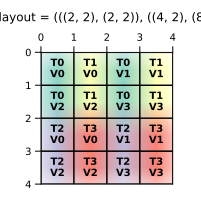
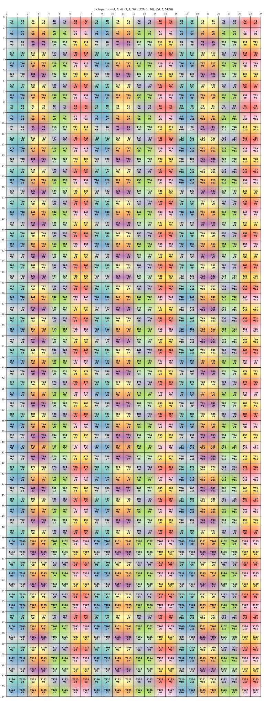

/*
> [!NOTE]
> This file is both a [cpp](../../tests/cpp/tutorial_cute_tv_layout.cpp) and
> a Markdown. You may see some strange symbols in the rendered Markdown.

Tutorial Difficulty: **Low** because it requires knowledge of (shape, stride)
tenosr layouts.

<!--*/
#pragma GCC diagnostic ignored "-Wcomment"
// clang-format off
/*
 * SPDX-FileCopyrightText: Copyright (c) 2025-present NVIDIA CORPORATION & AFFILIATES.
 * All rights reserved.
 * SPDX-License-Identifier: BSD-3-Clause
 */
// clang-format on

#include <sstream>
#include <string>

#include <gmock/gmock-matchers.h>
#include <gtest/gtest.h>

#include <tests/cpp/utils.h>
#include <tests/cpp/validator.h>

#include <ops/all_ops.h>
#include <scheduler/mma_utils.h>
#include <scheduler/tools/abstract_tensor.h>
#include <scheduler/tools/inlining.h>
#include <scheduler/utils.h>

#define NOT_IMPLEMENTED GTEST_SKIP() << "Not implemented yet";

namespace nvfuser {

using CuTeTutorial = NVFuserTest;

/* -->

# Creating a CuTe TV Layout in NvFuser

## What is CuTe?
CuTe is a layout algebra and a runtime abstraction for representing and handling
nested multi-dimensional layouts of threads, blocks, and data. It is used to
implement high-performance GEMM computation on Nvidia Hardware.

## What is a Layout?
A layout is a tuple of (Shape, Stride). It represents a mapping from shape
coordinate space to a 1D index using the stride. This is similar in concept to
the shape and stride of a PyTorch tensor. A key difference is the shape and
stride of a CuTe layout can be a nested tuple, allowing it to represent more
complex layouts.

# Layout Algebra

1. Coalesce
   * A simplify function to remove redundant shape dimensions without altering
     the Layout's function.
2. Composition
   * The composition of Layouts A and B is `(A o B)(c) := A(B(c))`.
   * Each coordinate is mapped to Layout B then onto Layout A.
   * The intuition behind composition is Layout B is selecting coordinated from
     Layout B.
3. Complement
   * Complement represents the rest of the elements not selected by the
     composition of A and B.
4. Division (Tiling)
   * Logical Divide of Layouts A and B returns the composition of A and B and
     its complement. i.e., the elements of Layout B selected by Layout A.
   * `logical_divide(A, B) = composition(A, (B, complement(B)))`
   * Use case is selecting a tile from a matrix for a given CTA.
5. Product (Tiling)
   * Logical Product of Layouts A and B returns the original Layout A and a
     transformed Layout B where each element is a replication of Layout A.
   * `logical_product(A, B) = (A, composition(complement(A), B))`

Reference: [CuTe Layout Algebra](https://docs.nvidia.com/cutlass/media/docs/cpp/cute/02_layout_algebra.html)

## What is Thread-Value (TV) Layout?
* The Thread-Value layout
`((thread_shape, value_shape), (thread_stride, value_stride))`
is a mapping of threads and values to an index.
* The main usage of TV layout is mapping the threads and its values of a CTA to
the index of a Tensor.

# Examples

## Simple TV Layout
Transform (4, 4) column-major tile into shape `((2, 2), (2, 2))` and
stride `((4, 2), (8, 1))`



Reference:
https://veitner.bearblog.dev/intuition-behind-hierarchical-layouts/
<!-- */ //-->\
```cpp
TEST_F(CuTeTutorial, SimpleThreadLayout) {
  NVFUSER_TEST_CUDA_ARCH_GUARD(9, 0);
  const auto dtype = DataType::BFloat16;

  DisableOptionsGuard disable_options_guard;
  DisableOptionsGuard::getCurOptions().set(DisableOption::MagicZero);

  // Fusion Definition
  std::unique_ptr<Fusion> fusion_ptr = std::make_unique<Fusion>();
  Fusion* fusion = fusion_ptr.get();
  FusionGuard fg(fusion);

  constexpr int dim0 = 4, dim1 = 4;
  TensorView* tv0 = makeContigConcreteTensor({dim0, dim1}, dtype);
  fusion->addInput(tv0);
  TensorView* tv1 = set(tv0);
  fusion->addOutput(tv1);

  // Set the allocation domain to column-major.
  tv0->setAllocationDomain({tv0->axis(1), tv0->axis(0)}, /*new_contiguity=*/true);
  tv1->reorder({1, 0}); // traverse rows then column.
  tv1->setAllocationDomain(tv1->getLoopDomain(), /*new_contiguity=*/true);

  fusion->printKernel();
  /*
  // The input and output tensors are column-major with shape (4, 4) and stride (1, 4).
  __global__ void CUDAGeneratedKernel(Tensor<__bfloat, 2, 2> T0, Tensor<__bfloat, 2, 2> T1) {
      #pragma unroll
      for(nvfuser_index_t i0 = 0LL; i0 < 4LL; ++i0) {
          nvfuser_index_t i1;
          i1 = 4LL * i0;
          #pragma unroll
          for(nvfuser_index_t i2 = 0LL; i2 < 4LL; ++i2) {
              nvfuser_index_t i3;
              i3 = i1 + i2;
              T1[i3]
                   = T0[i3];
          }
      }
  }
  */

  // Apply transformations to column-major TensorView
  tv1->split(-1, 2);
  tv1->split(0, 2);
  // Reorder to organize by Thread-Value Relationship
  tv1->reorder({{0, 2}, {1, 0}, {2, 1}});

  /*
  // After splitting and reordering the loop domain of TV1, the loop domain is [2, 2, 2, 2].
  // The strides of the loop domain are [4, 2, 8, 1].
  //
  // How to create CuTe TV layout from NvFuser TensorDomain?
  //   1) Reverse ordering from inner to outer loops.
  //   2) Gather modes 0 and 1 and 2 and 3 together.
  // This creates the shape ((2, 2), (2, 2)) and the stride ((1, 8), (2, 4)),
  // which corresponds with the CuTe Thread-Value Layout.
  */

  fusion->printKernel();
  /*
  __global__ void CUDAGeneratedKernel(Tensor<__bfloat, 2, 2> T0, Tensor<__bfloat, 2, 2> T1) {
    #pragma unroll
    for(nvfuser_index_t i0 = 0LL; i0 < 2LL; ++i0) {
      nvfuser_index_t i1;
      i1 = 4LL * i0;
      #pragma unroll
      for(nvfuser_index_t i2 = 0LL; i2 < 2LL; ++i2) {
        nvfuser_index_t i3;
        i3 = 2LL * i2;
        nvfuser_index_t i4;
        i4 = i1 + i3;
        #pragma unroll
        for(nvfuser_index_t i5 = 0LL; i5 < 2LL; ++i5) {
          nvfuser_index_t i6;
          i6 = i4 + (8LL * i5);
          bool b7;
          b7 = (i0 + (2LL * i5)) < 4LL;
          #pragma unroll
          for(nvfuser_index_t i8 = 0LL; i8 < 2LL; ++i8) {
            nvfuser_index_t i9;
            i9 = i6 + i8;
            if ((b7 && ((i3 + i8) < 4LL))) {
              T1[i9]
                 = T0[i9];
            }
          }
        }
      }
    }
  }
  */

  auto options = at::TensorOptions().dtype(at::kBFloat16).device(at::kCUDA, 0);
  at::Tensor at_tv0 = at::randn({dim0, dim1}, options).as_strided({dim0, dim1}, {1, dim0});

  KernelExecutor ke;
  ke.compile(fusion, {at_tv0});
  kir::Kernel* kernel = ke.compiledKernel()->kernel();
  ASSERT_TRUE(kernel != nullptr);
  auto cg_outputs = ke.run({at_tv0});
  NVF_CHECK(at::allclose(cg_outputs[0].as<at::Tensor>(), at_tv0));
}
/*
```
## Quack Reduction Base
Given a static CTA tile, apply 2D thread parallelization using threadIdx.x and
vectorization.


Reference:
https://github.com/Dao-AILab/quack/blob/main/quack/reduction_base.py#L35-L53
<!-- */ //-->\
```cpp
TEST_F(CuTeTutorial, VectorizeThreadLayout) {
  NVFUSER_TEST_CUDA_ARCH_GUARD(9, 0);
  const auto dtype = DataType::BFloat16;

  DisableOptionsGuard disable_options_guard;
  DisableOptionsGuard::getCurOptions().set(DisableOption::MagicZero);

  // Fusion Definition
  std::unique_ptr<Fusion> fusion_ptr = std::make_unique<Fusion>();
  Fusion* fusion = fusion_ptr.get();
  FusionGuard fg(fusion);

  constexpr int dim0 = 16, dim1 = 64;
  TensorView* tv0 = makeContigConcreteTensor({dim0, dim1}, dtype);
  fusion->addInput(tv0);
  TensorView* tv1 = set(tv0);
  fusion->addOutput(tv1);

  // Set the allocation domain to column-major.
  tv0->setAllocationDomain({tv0->axis(1), tv0->axis(0)}, /*new_contiguity=*/true);
  tv1->reorder({1, 0}); // traverse rows then column.
  tv1->setAllocationDomain(tv1->getLoopDomain(), /*new_contiguity=*/true);

  fusion->printKernel();
  /*
  // The input and output tensors are column-major with shape (16, 64) and stride (1, 16).
  __global__ void CUDAGeneratedKernel(Tensor<__bfloat, 2, 2> T0, Tensor<__bfloat, 2, 2> T1) {
    #pragma unroll
    for(nvfuser_index_t i0 = 0LL; i0 < 64LL; ++i0) {
      nvfuser_index_t i1;
      i1 = 16LL * i0;
      #pragma unroll
      for(nvfuser_index_t i2 = 0LL; i2 < 16LL; ++i2) {
        nvfuser_index_t i3;
        i3 = i1 + i2;
        T1[i3]
           = T0[i3];
      }
    }
  }
  */

  // Apply transformations to column-major TensorView
  tv1->split(0, 8); // tv1 [8, 8, 16]
  tv1->split(0, 8); // tv1 [1, 8, 8, 16]
  // Reorder to organize by Thread-Value Relationship
  // TV Layout T1_g___bfloat[iS6{1}, iS5{8}, iS2{16}, iS7{8}]
  tv1->reorder({{1, 3}, {2, 1}, {3, 2}}); // tv1 [1, 8, 16, 8]

  /*
  // Row-Major Tensor (16, 64): (64, 1)
  // tv1->split(-1, 8); // tv1 [16, 8, 8]
  // tv1->split(-1, 8); // tv1 [16, 1, 8, 8]
  // tv1->split(0, 16); // tv1 [1, 16, 1, 8, 8]
  //
  // After splitting and reordering the loop domain of TV1, the loop domain is
  // [1, 8, 16, 8]. The strides of the loop domain are [-, 16, 1, 128].
  //
  // How to create CuTe TV layout from NvFuser TensorDomain?
  //   1) Reverse ordering from inner to outer loops.
  //   2) Gather modes 0 and 1 and 2 and 3 together.
  // This creates the shape ((8, 16), (8, 1)) and the stride ((128, 1), (16, -))
  // which corresponds with the CuTe Thread-Value Layout.
  */

  fusion->printKernel();
  /*
  __global__ void CUDAGeneratedKernel(Tensor<__bfloat, 2, 2> T0, Tensor<__bfloat, 2, 2> T1) {
    #pragma unroll
    for(nvfuser_index_t i0 = 0LL; i0 < 8LL; ++i0) {
      nvfuser_index_t i1;
      i1 = 16LL * i0;
      #pragma unroll
      for(nvfuser_index_t i2 = 0LL; i2 < 16LL; ++i2) {
        nvfuser_index_t i3;
        i3 = i1 + i2;
        #pragma unroll
        for(nvfuser_index_t i4 = 0LL; i4 < 8LL; ++i4) {
          nvfuser_index_t i5;
          i5 = i3 + (128LL * i4);
          if (((i0 + (8LL * i4)) < 64LL)) {
            T1[i5]
               = T0[i5];
          }
        }
      }
    }
  }
  */

  auto options = at::TensorOptions().dtype(at::kBFloat16).device(at::kCUDA, 0);
  at::Tensor at_tv0 = at::randn({dim0, dim1}, options).as_strided({dim0, dim1}, {1, dim0});

  KernelExecutor ke;
  ke.compile(fusion, {at_tv0});
  kir::Kernel* kernel = ke.compiledKernel()->kernel();
  ASSERT_TRUE(kernel != nullptr);
  auto cg_outputs = ke.run({at_tv0});
  NVF_CHECK(at::allclose(cg_outputs[0].as<at::Tensor>(), at_tv0));
}
/*
```
## CuTe Hopper MMA Atom
Create register layout for a (128, 24) C accumulator tile.

### PTX WGMMA


### WGMMA Thread Value Layout


References:
https://docs.nvidia.com/cutlass/media/docs/cpp/cute/0t_mma_atom.html#hopper
<!-- */ //-->\
```cpp
TEST_F(CuTeTutorial, HopperWgmmaThreadLayout) {
  NVFUSER_TEST_CUDA_ARCH_GUARD(9, 0);
  const auto dtype = DataType::BFloat16;

  DisableOptionsGuard disable_options_guard;
  DisableOptionsGuard::getCurOptions().set(DisableOption::MagicZero);

  // Fusion Definition
  std::unique_ptr<Fusion> fusion_ptr = std::make_unique<Fusion>();
  Fusion* fusion = fusion_ptr.get();
  FusionGuard fg(fusion);

  constexpr int dim0 = 64, dim1 = 24;
  TensorView* tv0 = makeContigConcreteTensor({dim0, dim1}, dtype);
  fusion->addInput(tv0);
  TensorView* tv1 = set(tv0);
  fusion->addOutput(tv1);

  // Set the allocation domain to column-major.
  tv0->setAllocationDomain({tv0->axis(1), tv0->axis(0)}, /*new_contiguity=*/true);
  tv1->reorder({1, 0}); // traverse rows then column.
  tv1->setAllocationDomain(tv1->getLoopDomain(), /*new_contiguity=*/true);

  fusion->printKernel();
  /*
  // The input and output tensors are column-major with shape (16, 64) and stride (1, 16).
  __global__ void CUDAGeneratedKernel(Tensor<__bfloat, 2, 2> T0, Tensor<__bfloat, 2, 2> T1) {
    #pragma unroll
    for(nvfuser_index_t i0 = 0LL; i0 < 64LL; ++i0) {
      nvfuser_index_t i1;
      i1 = 16LL * i0;
      #pragma unroll
      for(nvfuser_index_t i2 = 0LL; i2 < 16LL; ++i2) {
        nvfuser_index_t i3;
        i3 = i1 + i2;
        T1[i3]
           = T0[i3];
      }
    }
  }
  */

  // Apply transformations to column-major TensorView
  tv1->split(-1, 8); // tv1 [24, 8, 8]
  tv1->split(-2, 2); // tv1 [24, 4, 2, 8]
  tv1->split(0, 2); // tv1 [12, 2, 4, 2, 8]
  tv1->split(0, 4); // tv1 [3, 4, 2, 4, 2, 8]
  // Reorder to organize by Thread-Value Relationship
  tv1->reorder({{0, 5}, {1, 0}, {2, 3}, {3, 2}, {5, 1}});
  // tv1 [4n, 8m, 4m, 2n, 2m, 3n]

  /*
  // After splitting and reordering the loop domain of TV1, the loop domain is
  // [4, 8, 4, 2, 2, 3]. The strides of the loop domain are
  // [128, 1, 16, 64, 8, 512].
  //
  // How to create CuTe TV layout from NvFuser TensorDomain?
  //   1) Reverse ordering from inner to outer loops.
  //   2) Gather modes [0-2] and [3-5] together.
  // This creates the shape ((4, 8, 4), (2, 2, 3)) and the stride
  // ((128, 1, 16), (64, 8, 512)), which corresponds with the CuTe Thread-Value
  // Layout.
  */

  fusion->printKernel();
  /*
  __global__ void CUDAGeneratedKernel(Tensor<__bfloat, 2, 2> T0, Tensor<__bfloat, 2, 2> T1) {
    #pragma unroll
    for(nvfuser_index_t i0 = 0LL; i0 < 4LL; ++i0) {
      nvfuser_index_t i1;
      i1 = 128LL * i0;
      nvfuser_index_t i2;
      i2 = 2LL * i0;
      #pragma unroll
      for(nvfuser_index_t i3 = 0LL; i3 < 8LL; ++i3) {
        nvfuser_index_t i4;
        i4 = i1 + i3;
        #pragma unroll
        for(nvfuser_index_t i5 = 0LL; i5 < 4LL; ++i5) {
          nvfuser_index_t i6;
          i6 = 16LL * i5;
          nvfuser_index_t i7;
          i7 = i4 + i6;
          nvfuser_index_t i8;
          i8 = i3 + i6;
          #pragma unroll
          for(nvfuser_index_t i9 = 0LL; i9 < 2LL; ++i9) {
            nvfuser_index_t i10;
            i10 = i7 + (64LL * i9);
            nvfuser_index_t i11;
            i11 = i2 + i9;
            #pragma unroll
            for(nvfuser_index_t i12 = 0LL; i12 < 2LL; ++i12) {
              nvfuser_index_t i13;
              i13 = 8LL * i12;
              nvfuser_index_t i14;
              i14 = i10 + i13;
              bool b15;
              b15 = (i8 + i13) < 64LL;
              #pragma unroll
              for(nvfuser_index_t i16 = 0LL; i16 < 3LL; ++i16) {
                nvfuser_index_t i17;
                i17 = i14 + (512LL * i16);
                if ((b15 && ((i11 + (8LL * i16)) < 24LL))) {
                  T1[i17]
                     = T0[i17];
                }
              }
            }
          }
        }
      }
    }
  }
  */


  auto options = at::TensorOptions().dtype(at::kBFloat16).device(at::kCUDA, 0);
  at::Tensor at_tv0 = at::randn({dim0, dim1}, options).as_strided({dim0, dim1}, {1, dim0});

  KernelExecutor ke;
  ke.compile(fusion, {at_tv0});
  kir::Kernel* kernel = ke.compiledKernel()->kernel();
  ASSERT_TRUE(kernel != nullptr);
  auto cg_outputs = ke.run({at_tv0});
  NVF_CHECK(at::allclose(cg_outputs[0].as<at::Tensor>(), at_tv0));
}

TEST_F(CuTeTutorial, BulkLoad) {
  NVFUSER_TEST_CUDA_ARCH_GUARD(9, 0);

  // Fusion Definition
  std::unique_ptr<Fusion> fusion_ptr = std::make_unique<Fusion>();
  Fusion* fusion = fusion_ptr.get();
  FusionGuard fg(fusion);

  constexpr at::ScalarType dtype = at::ScalarType::Float;
  constexpr int dim0 = 32, dim1 = 32;
  TensorView* tv0 = makeContigConcreteTensor({dim0, dim1}, aten_to_data_type(dtype));
  fusion->addInput(tv0);
  TensorView* tv1 = set(tv0);
  fusion->addOutput(tv1);

  TensorView* tv0_cache = tv0->cacheAfter(LoadStoreOpType::CpAsyncBulk);
  tv0_cache->setMemoryType(MemoryType::Shared);
  tv0_cache->axis(0)->parallelize(ParallelType::Bulk);
  tv0_cache->axis(1)->parallelize(ParallelType::Bulk);
  inlineMost();

  auto options = at::TensorOptions().dtype(dtype).device(at::kCUDA, 0);
  at::Tensor at_tv0 = at::randn({dim0, dim1}, options);

  KernelExecutor ke;
  CompileParams index32bit{DataType::Int32, 255, false};
  ke.compile(fusion, {at_tv0}, {}, index32bit);
  auto outputs = ke.run({at_tv0});
  testValidate(fusion, outputs, {at_tv0}, {at_tv0}, __LINE__, __FILE__);
}
/*
```
<!--*/
} // namespace nvfuser
// \-->
