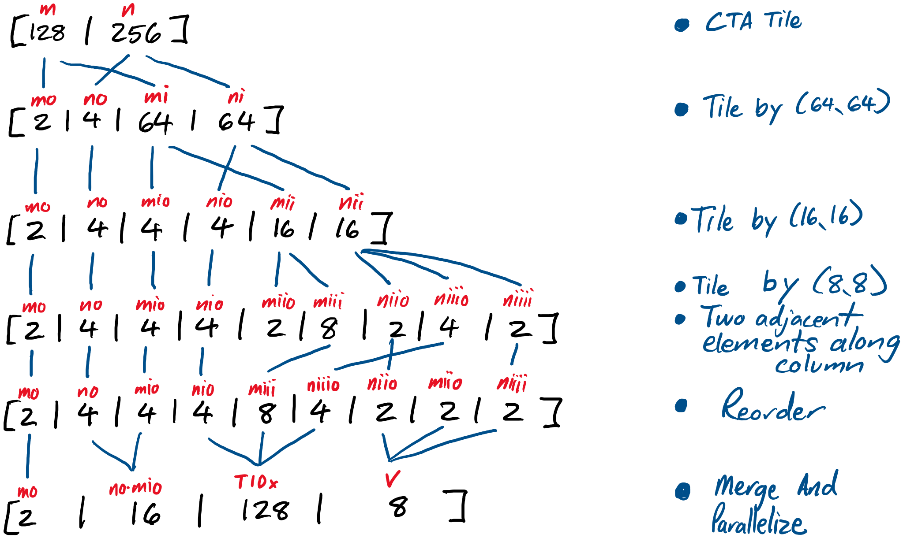

/*
> [!NOTE]
> This file is both a [cpp](../../tests/cpp/tutorial_ldmatrix_stmatrix.cpp) and
> a Markdown. You may see some strange symbols in the rendered Markdown.

Tutorial Difficulty: **Moderate-High** because it requires knowledge of
LdMatrix, StMatrix, TMA, and WGMMA

<!--*/
#pragma GCC diagnostic ignored "-Wcomment"
// clang-format off
/*
 * SPDX-FileCopyrightText: Copyright (c) 2023-present NVIDIA CORPORATION & AFFILIATES.
 * All rights reserved.
 * SPDX-License-Identifier: BSD-3-Clause
 */
// clang-format on

#include <sstream>
#include <string>

#include <gmock/gmock-matchers.h>
#include <gtest/gtest.h>

#include <tests/cpp/utils.h>
#include <tests/cpp/validator.h>

#include <ops/all_ops.h>
#include <scheduler/mma_utils.h>
#include <scheduler/tools/abstract_tensor.h>
#include <scheduler/tools/inlining.h>
#include <scheduler/utils.h>

#define NOT_IMPLEMENTED GTEST_SKIP() << "Not implemented yet";

namespace nvfuser {

using HopperLdStMatrixTutorial = HopperBase;

/* -->

# LdMatrix and StMatrix Support in NVFuser

### What is LdMatrix?
A warp-level instruction to load matrices from shared memory to registers.

```
ldmatrix.sync.aligned.shape.num{.trans}{.ss}.type r, [p];

ldmatrix.sync.aligned.m8n16.num{.ss}.dst_fmt.src_fmt        r, [p];
ldmatrix.sync.aligned.m16n16.num.trans{.ss}.dst_fmt.src_fmt r, [p];

.shape   = {.m8n8, .m16n16};
.num     = {.x1, .x2, .x4};
.ss      = {.shared{::cta}};
.type    = {.b16, .b8};
.dst_fmt = { .b8x16 };
.src_fmt = { .b6x16_p32, .b4x16_p64 };
```
Reference: [LdMatrix PTX](https://docs.nvidia.com/cuda/parallel-thread-execution/#warp-level-matrix-load-instruction-ldmatrix)

### What is StMatrix?
A warp-level instruction to store matrices from registers to shared memory.

```
stmatrix.sync.aligned.shape.num{.trans}{.ss}.type [p], r;

.shape  = {.m8n8, .m16n8};
.num    = {.x1, .x2, .x4};
.ss     = {.shared{::cta}};
.type   = {.b16, .b8};
```

Reference: [StMatrix PTX](https://docs.nvidia.com/cuda/parallel-thread-execution/#warp-level-matrix-store-instruction-stmatrix)

### General Details

For 16-bit element size, the matrix shape is (8, 8).
The instruction can process one, two, or four (8, 8) matrices per instruction.

### Indices shared memory tensor
Each thread in the warp specifies a matrix row in shared memory. For LdMatrix,
the shared memory tensor is an input TensorView. For StMatrix, it is an output
TensorView.

* Threads 0-7 correspond with matrix rows of first matrix. (x1, x2, and x4)
* Threads 8-15 correspond with matrix rows of second matrix. (x2 and x4)
* Threads 16-23 correspond with matrix rows of third matrix. (x2 and x4)
* Threads 24-31 correspond with matrix rows of fourth matrix. (x4 only)

### Indices for register tensor
For an (8, 8) matrix of 16-bit elements, this is the register layout for a warp.
Each threads stores two adjacent elements along the inner-most dimension.
* [m(8), n(8)] // An (8, 8) matrix of 16-bit elements
* [m(8), no(4), ni(2)]  // Split column dimension by 2
* [m(8) * no(4) (TDX), ni[2]) // Merge row dimension and column stride

#### Register layout for one 8x8 Matrix with 16-bit elements


# Example 1: A copy kernel using TMA, LdMatrix, and StMatrix.

The first example is a simple copy kernel using only TMA, LdMatrix, and
Stmatrix. The next example incorporates wgmma and pointwise computation into a
fusion.

The goal for this cuda kernel is to load data from shared memory, produced by
TMA Load with 128B swizzle, to registers using LdMatrix. After some computation,
the data is loaded from registers into shared memory, which is consumed by a
TMA Store with 128B swizzle.

## How to compute the index into register TensorView?

The register index is based on loop domain and is handled by IdModel
indexing. For LdMatrix, we must set the allocation domain using the
scheduled loop domain.

## How to compute the index into shared memory TensorView?

The index into shared memory requires a custom index from loop domain to the
TMA LoadStoreOp allocation domain.

Figure 1 shows how the CTA tile is transformed into the loop domain
for LdMatrix or StMatrix. Figure 2 displays the loop transformations for TMA
Load or Store operations. Figure 3 illustrates the following steps to compute
index from LdMatrix or StMatrix loop domain to TMA shared memory domain.

**Step 1:** Derive (8, 8) core matrix components for LdMatrix / StMatrix from
for-loop indices.

**LdMatrix (8, 8) IterDomain Layout:**

`mo(2), no(4), mio(4), nio(4), miio(2), miii(8), niio(2), niii(8)`

<details>

 * Undo last two steps, **Merge And Parallelize** and **Reorder** from Figure 1
 * Merge `n_iiio(4)` and `n_iiii(2)` together to form megabank size IterDomain

</details>

**Step 2:** Merge and reorder components to get the allocation domain for TMA
LoadStoreOp with 128B swizzle.

**TMA LoadStoreOp with 128B swizzle IterDomain Layout:**

`mo(2), no(4), mio * miio (8), miiio(8), miiii(1), nio * niio (8), niii(8)`

<details>

 * Merge `mio(4)` and `miio(2)` = 8
 * `miii(8)` is the maximum number of rows in swizzle.
 * Split `miii(8)` into `miiio(8)` and `miiii(1)` by repetitions for 128B swizzle.
 * Merge `nio(4)` and `niio(2)` = 8

</details>

**Step 3:** XOR swizzle `m_io(8)` and `(nooi * n_o)(8)` to get new ldmatrix tile
column.

**Step 4:** Combine index components according to TMA LoadStoreOp to create the
input index into shared memory.

### Figure 1: Loop domain for LdMatrix and StMatrix


### Figure 2: TMA shared memory domain

<details>

Let `swizzle_bytes` = 128B.
The CTA tile is m(128), n(256)

**Step 1:** Split m by two compute warp groups; Split n by four tiles for 128B swizzle
* IterDomain: [mo(2), mi(64), no(4), ni(64)]

**Step 2:**  Reorder to create tma box
* IterDomain: [mo(2), no(4), mi(64), ni(64)]

**Step 3:** Split mi(64) by max swizzle rows
* `(128B / swizzle_bytes) * (swizzle_bytes / 16B) = max swizzle rows (8)`
* IterDomain: mo(2), no(4), mio(8), mii(8), nio(8), nii(8)

**Step 4:** Split ni by megabank size (128-bit or 16B or 8 elements)
* ni(64) is 64x2B elements = 128B. 8x2B elements is 16B or 128-bits.
* IterDomain: [mo(2), no(4), mi(64), nio(8), nii(8)]

**Step 5:** Split mii(8) by number of swizzle repetitions
* `(128B / swizzle_bytes) = number of swizzle-repetitions`
* IterDomain: [mo(2), no(4), mio(8), miio(8), miii(8), nio(8), nii(8)]

**Step 6:** Apply XOR swizzle between rows (miio) and megabanks(nio) for swizzle
* IterDomain: mo(2), no(4), mio(8), miio(8), miii(1), nio(8), nii(8)
* Description for each IterDomain:
1. TDY
2. Serial
3. Serial
4. Serial
5. Number of rows in swizzle
6. Number of row the swizzle pattern is repeated.
7. Number of megabanks in swizzle.
8. Size of Megabanks.

</details>


### Figure 3: Map from LdMatrix / StMatrix loop domain to TMA shared memory domain


## Code Walkthrough
The LdStMatrixSet example is a simple copy kernel that load and stores data
via TMA, LdMatrix, and StMatrix.

| TensorView | Definition | Memory Space | Notes                |
| ---------- | ---------- | ------------ | -------------------- |
| tv0        | None       | Global       | Input                |
| tv0_smem   | TMA-Load   | Shared       | 128B Swizzle         |
| tv0_reg    | LdMatrix   | Registers    | None                 |
| tv1_smem   | StMatrix   | Shared       | None                 |
| tv1        | TMA-Store  | Global       | Output; 128B Swizzle |

### scheduleLdStMatrix function

The scheduleLdStMatrix function creates and schedules an abstract tensor for a
TensorView with a ldmatrix or stmatrix definition. The layout is based on the
register accumulation layout for wgmma and the hard-coded index supported by
the indexing pass. <!-- */ //-->\
```cpp
AbstractTensor scheduleLdStMatrix(TensorView* tv) {
  // Assume the input TensorView is block tiled. e.g., The last two iterDomains
  // are the warp tile except for k dimension.
  // The CTA tile is (128, 256).
  // The Warp tile is (64, 256).
  // The TMA box is (64, 64).
  // The LdStMatrix.x4 tile is (16, 16).
  // The core matrix for wgmma and LdStMatrix is (8, 8).

  AbstractTensor abstract_tensor(tv->getLoopDomain());
  // (GM, GN, cta_m(2), cta_n(1), m(64), n(256))

  // Split by TMA shared memory box
  abstract_tensor.split(-1, 64);
  abstract_tensor.reorder({{-2, -3}, {-3, -2}});
  // (GM, GN, cta_m(2), cta_n(1), no(4), m(64), ni(64))

  // Split by (16, 16) matrix for LdStMatrix.x4
  abstract_tensor.split(-2, 16);
  abstract_tensor.split(-1, 16);
  abstract_tensor.reorder({{-2, -3}, {-3, -2}});
  // (GM, GN, cta_m(2), cta_n(1), no(4), mo(4), nio(4), mi(16), nii(16))

  // Split (16, 16) matrix into four (8, 8) sub-matrices
  abstract_tensor.split(-2, 8);
  abstract_tensor.split(-1, 8);

  // Each register handles two adjacent elements.
  abstract_tensor.split(-1, 2);

  // The four (8, 8) sub-matrices are traversed in this order to follow the
  // register layout for wgmma accumulator matrix.
  // *****************
  // *       *       *
  // *       *       *
  // *   0   *   2   *
  // *       *       *
  // *       *       *
  // *****************
  // *       *       *
  // *       *       *
  // *   1   *   3   *
  // *       *       *
  // *       *       *
  // *****************
  abstract_tensor.reorder({{-5, -2}, {-4, -5}, {-2, -4}});
  // (GM, GN, cta_m(2), cta_n(1), no(4), mo(4), nio(4), mii(8), niiio(4),
  // niio(2), mio(2), niiii(2))

  // For an (16, 16) matrix, each register will hold 8 values. The LdStMatrix
  // instruction will load or store these values with a single instruction. We
  // remove this serial for-loop from the kernel by merging the last three
  // iterDomains together and then applying ParallelType::Vectorize.
  abstract_tensor.merge(-2, -1);
  abstract_tensor.merge(-2, -1);
  // (GM, GN, cta_m(2), cta_n(1), no(4), mo(4), nio(4), mii(8), niiio(4), (niio
  // * mio * niiii)(8))

  // Reorder iterDomains so the serial IterDomain for (CTA_N / TMA_N) and
  // (TMA_N and LDST_N) are adjacent.
  abstract_tensor.reorder({{-5, -4}, {-4, -5}});

  // Four LdStMatrix.x4 instructions are issued simultaneously to process
  // (64, 16) tile. Merge mio, miii, and niiio iterDomains together.
  abstract_tensor.merge(-4, -3);
  abstract_tensor.merge(-3, -2);
  // (GM, GN, cta_m(2), cta_n(1), no(4), nio(4), (mo * mii * niiio)(128), (niio
  // * mio * niiii)(8))

  // Hard-coded shared memory index expects a single serial IterDomain
  abstract_tensor.merge(-4, -3);
  return abstract_tensor;
}

// This test is an example of loading and storing a Tensor using TMA, LdMatrix,
// and StMatrix.
TEST_F(HopperLdStMatrixTutorial, LdStMatrixSet) {
  const auto dtype = DataType::BFloat16;

  // Fusion Definition
  Fusion fusion;
  FusionGuard fg(&fusion);

  TensorView* tv0 = makeContigConcreteTensor({-1, -1}, dtype); // M, K
  fusion.addInput(tv0);
  TensorView* tv1 = set(tv0);
  fusion.addOutput(tv1);

  // ===========================================================================

  // Constants
  constexpr int64_t cta_m = 128;
  constexpr int64_t cta_n = 256;
  constexpr int64_t warp_m = 64;
  constexpr int64_t warp_n = 256;
  constexpr int64_t ldst_matrix_tile_m = 16;
  constexpr int64_t ldst_matrix_tile_n = 16;
  fusion.manage("ldst_matrix_m_tile", ldst_matrix_tile_m);
  fusion.manage("ldst_matrix_n_tile", ldst_matrix_tile_n);
  fusion.manage("ldst_matrix_m_smem", warp_m);
  fusion.manage("ldst_matrix_n_smem", warp_n);

  // ===========================================================================
  // Create cache intermediate TensorViews
  // The definition for tv0_smem is tma load, which moves data from shared to
  // global memory.
  TensorView* tv0_smem = tv0->cacheAfter();
  tv0_smem->definition()->as<LoadStoreOp>()->setOpType(
      LoadStoreOpType::CpAsyncBulkTensorTile);
  tv0_smem->setMemoryType(MemoryType::Shared);

  // TODO Add ldmatrix support
  // The definition for tv0_reg is ldmatrix, which moves data from shared memory
  // to registers.
  TensorView* tv0_reg = tv0_smem->cacheAfter();
  tv0_reg->definition()->as<LoadStoreOp>()->setOpType(
      LoadStoreOpType::LdMatrix);

  // The definition for tv1_smem is stmatrix, which moves data from registers to
  // shared memory.
  TensorView* tv1_smem = tv1->cacheBefore();
  tv1_smem->definition()->as<LoadStoreOp>()->setOpType(
      LoadStoreOpType::StMatrix);
  tv1_smem->setMemoryType(MemoryType::Shared);

  // The definition for tv1 is tma store, which moves data from shared to global
  // memory.
  tv1->definition()->as<LoadStoreOp>()->setOpType(
      LoadStoreOpType::CpAsyncBulkTensorTile);

  // ===========================================================================
  // General scheduling
  // Tile reference by cta_tile and warp_tile
  // (M, N)
  tv1->split(0, cta_m);
  tv1->split(-1, cta_n);
  tv1->reorder({{-2, -3}, {-3, -2}});
  // (GM, GN, cta_m(128), cta_n(256))

  tv1->split(-2, warp_m);
  tv1->split(-1, warp_n);
  tv1->reorder({{-2, -3}, {-3, -2}});
  // (GM, GN, cta_m(2), cta_n(1), warp_m(64), warp_n(256))

  TransformPropagator propagator(tv1);
  MaxLogicalDomainInfoSpanningTree(tv1).traverse(&propagator);

  tv1->axis(0)->parallelize(ParallelType::BIDx);
  tv1->axis(1)->parallelize(ParallelType::BIDy);
  tv1->axis(2)->parallelize(ParallelType::TIDy);
  scheduler_utils::parallelizeAllLike(tv1);

  // ===========================================================================
  // Schedule shared memory tensors using TMA Load and Store

  // Schedule output from TMA Load
  MmaInputSmemSwizzle input_swizzle =
      mma_utils::tmaSwizzleSharedMemory(tv0_smem);
  mma_utils::MmaSwizzler::scheduleTMALoadForMma(tv0_smem, input_swizzle);

  // Schedule global memory output from TMA Store
  MmaInputSmemSwizzle output_swizzle =
      mma_utils::tmaSwizzleSharedMemory(tv1_smem);
  mma_utils::scheduleTMAStoreForMmaOutput(tv1, output_swizzle);

  // ===========================================================================
  // Schedule register tensors using LdMatrix and StMatrix

  // NOTE: When using a custom allocation domain, all iterDomains to the left
  // of the computeAt position must exist in the loop domain. The utility
  // function for applying swizzle to TMA LoadStoreOp creates the appropriate
  // TMA Box. Creating the same TMA Box in the loop domain via AbstractTensor
  // allows for inlining iterDomains that are not identical, causing an
  // assertion in indexing pass.

  // Move data from tv0_reg to tv1_smem using StMatrix
  AbstractTensor tv1_smem_abstract_tensor =
      scheduleLdStMatrix(tv1_smem);
  // Create tma store allocation domain with swizzle
  if (output_swizzle != MmaInputSmemSwizzle::None) {
    mma_utils::scheduleTMAStoreForMmaOutput(tv1_smem, output_swizzle);
  }
  tv1_smem->setLoopDomain(tv1_smem_abstract_tensor.as<IterDomain*>());
  // (GM(BDX), GN(BDY), cta_m(2), cta_n(1), (no * nio)(16), (mo * mii *
  // niiio)(128), (niio * mio * niiii)(8))

  // Use ParallelType::TIDx to launch four StMatrix.x4 in parallel.
  // Use ParallelType::Vectorize because StMatrix.x4 stores eight elements per
  // thread per operation.
  tv1_smem->axis(-2)->parallelize(ParallelType::TIDx);
  tv1_smem->axis(-1)->parallelize(ParallelType::Vectorize);
  // (GM(BDX), GN(BDY), cta_m(2)(TDY), cta_n(1), (no * nio)(16), (mo * mii *
  // niiio)(128)(TDX), (niio * mio * niiii)(8)(V))

  // ===========================================================================

  // Move data from tv0_reg to tv1_smem using LdMatrix
  AbstractTensor tv0_reg_abstract_tensor =
      scheduleLdStMatrix(tv0_reg);
  tv0_reg->setLoopDomain(tv0_reg_abstract_tensor.as<IterDomain*>());
  // (GM(BDX), GN(BDY), cta_m(2), cta_n(1), (no * nio)(16), (mo * mii *
  // niiio)(128), (niio * mio * niiii)(8))

  // Set allocation domain according to loop domain
  tv0_reg->setAllocationDomain(
      tv0_reg->getLoopDomain(), /*new_contiguity=*/true);

  // Use ParallelType::TIDx to launch four LdMatrix.x4 in parallel.
  // Use ParallelType::Vectorize because LdMatrix.x4 stores eight elements per
  // thread per operation.
  tv0_reg->axis(-2)->parallelize(ParallelType::TIDx);
  tv0_reg->axis(-1)->parallelize(ParallelType::Vectorize);
  // (GM(BDX), GN(BDY), cta_m(2)(TDY), cta_n(1), (no * nio)(16), (mo * mii *
  // niiio)(128)(TDX), (niio * mio * niiii)(8)(V))

  // ===========================================================================

  inlineMost();

  // ===========================================================================

  constexpr int dim0 = 8192, dim1 = 8192;
  auto options = at::TensorOptions().dtype(at::kBFloat16).device(at::kCUDA, 0);
  at::Tensor at_tv0 = at::randn({dim0, dim1}, options);

  KernelExecutor ke;
  ke.compile(&fusion, {at_tv0});
  kir::Kernel* kernel = ke.compiledKernel()->kernel();
  ASSERT_TRUE(kernel != nullptr);
  auto cg_outputs = ke.run({at_tv0});
  NVF_CHECK(at::allclose(cg_outputs[0].as<at::Tensor>(), at_tv0));
} /*
```

# Example 2: An epilogue computation after WGMMA operation.

This example explains how to schedule the epilogue computation in a matrix
multiplication fusion. One operand is the result from a wgmma operation. The
other operand is another tensor in global memory.

```python
# The result from matmul
c_reg = matmul(a, b)

# Load epilogue input into shared memory using TMA load with 128B swizzle.
d_smem = tma_load(d)

# Load epilogue input into registers using LdMatrix
d_reg = ldmatrix(d_smem)

# Epilogue computation
e_reg = pointwise(c_reg, d_reg)

# Store epilogue result into shared memory using StMatrix
e_smem = stmatrix(e_reg)

# Store epilogue result into global memory using TMA store with 128B swizzle.
e = tma_store(e_smem)
```

* All tensors are transformed by `blockTileTensors` and
`transformLikeMmaOutputWithoutK`. `blockTileTensors` divides logical domain by
CTA tile, while `transformLikeMmaOutputWithoutK` splits the TensorView by warp
tile and mma macro.

## How to compute the index into register TensorView?

Same as the previous example, the register index is based on loop domain and
is handled by IdModel indexing. For LdMatrix, we must set the allocation domain
using the scheduled loop domain.

## How to compute the index into shared memory TensorView?

The index into shared memory requires a custom index from shared memory loop
domain to the TMA LoadStoreOp allocation domain.

* `c_reg`, `d_reg`, and `e_reg` have an allocation domain created using
`scheduleMmaOutputAllocation`, which is required by the TensorCore ptx
instructions.
* The loop domains for `d_reg` and `e_smem` are transformed from the domain
created by `scheduleMmaOutputAllocation` using `scheduleStmatrixForMmaOutput`.
* To create the shared memory index, we map from loop domain for LdMatrix or
StMatrix to `MmaOutputAllocation` first. Then, those iterDomains are mapped to
TMA allocation domain.

## What is the loop domain for LdMatrix and StMatrix?

Given a 2D tensor, applying the following transformations to schedule the loop
domain.

1. `blockTileTensors` divides logical domain by CTA tile.
2. `transformLikeMmaOutputWithoutK` splits by warp tile and mma macro.
3. `mma_utils::scheduleStMatrixForMmaOutput` schedules iterDomains corresponding
with mma macro for StMatrix expression.

Loop Domain: `moo * mi * nio (128) (TDX), noo(16), noi * moi * nii (2) (V)`

## The for-loop structure given loop domain

``` python
for TDY(2):
  for TDX(128):
    for Serial(16):
      for V(8):
        # LdMatrix(registers, shared_memory)
    for Serial(32):
      for Serial(2):
        for Serial(2):
          for Serial(2):
            # epilogue compute
    for Serial(16):
      for V(8):
        # StMatrix(shared_memory, registers)
```

## How to derive shared memory index?
**Step 1:** Derive WGMMA index components from for-loop indices.

<details>

* TDY(2)
* TDX(128) maps to [moo(4), mi(8), nio(4)]
* Serial(16) maps [noo(16)]
* Vectorize(8) maps [noi(2), moi(2), nii(2)]

</details>

**Step 2:** Create index components for the four ldmatrix.x4 instructions issued
by 128 thread warp-group.

**LdMatrix warp-group.x4 IterDomain Layout:**

`TDY(2), moo(4), nooo(4), nooi(4), (mi * moi)(16), (nio * nii * noi)(16)`

<details>

1. `moo(4) = (mma_m == tma_m == 64) / (ldmatrix == stmatrix == 16)`
2. Split `noo(16) into `nooo(4)` and `nooi(4)`
  * `nooo(4) = (mma_n == 256) / (tma_n == 64)`
  * `nooi(4) = (tma_n == 64) / (ldmatrix == stmatrix == 16)`
3. Remaining m and n components from wgmma are combined into (16, 16)
ldmatrix and stmatrix
  * `16 = mi(8) * moi(2)` is the m component of ldmatrix and stmatrix
  * `16 = nio(4) * nii (2) * noi(2)` is the n component of ldmatrix and stmatrix

</details>

**Step 3:** Split (16, 16) LdMatrix into four (8, 8) LdMatrix components.

**LdMatrix (8, 8) IterDomain Layout:**

`TDY(2), moo(4), nooo(4), nooi(4), m_o(2), m_i(8), n_o(2), n_i(8)`

**Step 4:** Merge and reorder components to get the allocation domain for TMA
LoadStoreOp with 128B swizzle.

**TMA LoadStoreOp with 128B swizzle IterDomain Layout:**

`TDY(2), no(4), moo * m_o (8), m_io(8), m_ii(1), nooi * n_o (8), n_i(8)`

<details>

 * `no(4) == nooo(4)` is the outer loop index in ldmatrix and tma
 * Merge `moo(4)` and `m_o(2)` = 8
 * `m_i(8)` is the maximum number of rows in swizzle.
 * Split `m_i(8)` into `m_io(8)` and `m_ii(1)` by repetitions for 128B swizzle.
 * Merge `nooi(4)` and `n_o(2)` = 8

</details>

**Step 5:** XOR swizzle `m_io(8)` and `(nooi * n_o)(8)` to get new ldmatrix tile
column.

**Step 6:** Combine index components according to TMA LoadStoreOp to create the
input index into shared memory.

<!--*/
} // namespace nvfuser
// \-->
