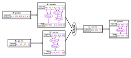
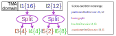
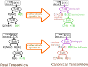
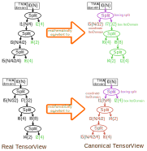

<!--
 * SPDX-FileCopyrightText: Copyright (c) 2023-present NVIDIA CORPORATION & AFFILIATES.
 * All rights reserved.
 * SPDX-License-Identifier: BSD-3-Clause
-->

# Introduction to TMA Support in NVFuser

## Introduction

TMA is a hardware feature that allows the GPU to load a tile from a tensor of up to 5D.
The tile can be dense, or strided, as shown in Figure 1 below:


When using phrases like "tile size", it is important to be clear what we are referring to.
Here we use two separate words *box* and *tile* to refer to different things.

**Definition 1**: In an N-dimensional tensor, a *box* of size `(s1, s2, ..., sN)` at
`(x1, x2, ..., xN)` refers to all the `s1*s2*...*sN` items at `(x1, x2, ..., xN)`,
`(x1, x2, ..., xN + 1)`, ..., `(x1, x2, ..., xN + sN - 1)`, ..., `(x1 + s1 - 1, x2 + s2 - 1, ..., xN + sN - 1)`.

**Definition 2**: In an N-dimensional tensor, a *tile* of size `(s1, s2, ..., sN)` and stride
`(r1, r2, ..., rN)` at `(x1, x2, ..., xN)` refers to all the `s1*s2*...*sN` items at
`(x1, x2, ..., xN)`, `(x1, x2, ..., xN + rN)`, ..., `(x1, x2, ..., xN + rN * (sN - 1))`,
..., `(x1 + r1 * (s1 - 1), x2 + r2 * (s2 - 1), ..., xN + rN * (sN - 1))`.

In Figure 1, we have box size `(8, 4)` for both diagram.
For the diagram on the left, we have tile size `(8, 4)` and stride `(1, 1)`.
For the diagram on the right, we have tile size `(8, 2)`, and stride `(1, 3)`.

Note that TMA PTX instructions and CUDA driver API uses column-major,
and we want to be consistent with them.
So here we say we have box size `(8, 4)` instead of `(4, 8)`.

Box and tile for the above example is shown below in Figure 2:


## Schedule

In order to use TMA, we need to tell the hardware what is the dimensionality of our tensor.
Most naively, we can make this dimensionality the size of the allocation domain.
This naive mental model does provide us an easy way to reason about and start using TMA,
but unfortunately it is not flexible enough and is not consistent with how we think about scheduling.
For example, if we want to schedule a fusion containing only pure pointwise (i.e. no broadcasting) operations and all input and output tensors are contiguous,
regardless of the actual dimensionality of the input and output tensors, in our mental model, we always
consider this problem as a 1D problem by viewing all tensors as flattened 1D tensor.
For this case, ideally, we should be using 1D TMA, instead of using the actual dimensionality of the tensor.
That is, the dimensionality of TMA is not necessarily the same as the dimensionality of the tensor.

In order to support the flexibility of using a dimensionality of TMA different from the dimensionality of the tensor,
we design the scheduling of TMA as a multiple-step process:

### Step 1: define TMA domain

When a user is ready to schedule the consumer of the TMA expression,
the user should already have an idea of how the problem should be viewed.
For example, if the user is scheduling a fusion with only pure pointwise ops,
the user would want to view the problem as a 1D problem.
If the user is scheduling a transpose, then the user might want to view the problem as 2D.
If the user is scheduling a matmul, then the user might want to view the problem as 3D.
From this view of the problem, the user should have an idea about what are the dimensionalities of tensors.

For example, if the user wants to schedule a matmul `(M1, M2, K1, K2, K3) x (K1, K2, K3, N) -> (M1, M2, N)`,
then in the mind of the user, this matmul will be a 3D problem `(M1*M2, K1*K2*K3, N)`.
In this mental model, the input and output tensors are all 2D:
`(M1*M2, K1*K2*K3)`, `(K1*K2*K3, N)`, and `(M1*M2, N)`.

The first step of scheduling TMA is to schedule the consumer of the TMA expression the way matching the mental model of the problem.
The result domain of this step is called the *TMA domain*.

The TMA domain for the above matmul example is shown in the Figure 3 below:



Please note that the TMA domain is not a member of a TensorDomain like the root/logical/allocation/loop domains.
Instead, it is a virtual domain that only exists in the user's mind.

Also note that the IterDomain expressions between the global tensor's allocation domain and the TMA domain must be a view,
for example, we can not merge discontiguous IterDomains ([why?](../reading/divisibility-of-split.md#merging-discontiguous-iterdomains)), and we can not have indivisible splits either.

### Step 2: define box

After having scheduled a TMA domain, the next step is to define box.
There are two ways of defining box: partitioning and compositing.

#### The canonical way to define box

The canonical way to define box is by partitioning.
It is as simple as: select an IterDomain in the TMA domain, then
inner split that IterDomain by the box size of that dimension.

We call this split expression a "*boxing split*", the input of this split a "*partitioned IterDomain*",
the inner output of this split a "*box IterDomain*", and the outer output of this split a "*coordinate IterDomain*".

For the case of Figure 1, if both box dimensions are defined by partitioning,
the schedule should look like the Figure 4 below:



Please note that, although in the above example, the split is divisible, this does not have to be the case in general.

#### Define box by mathematical equivalence

Ideally, for an arbitrary schedule,
as long as there exist a canonical way of defining box that is mathematically equivalent to this schedule,
during lowering, we should be able to automatically translate this schedule to the canonical way and infer all the informations needed for generating a TMA instruction.

Mathematical equivalence of IterDomain transformations is studied in [The Mathematical Theory of IterDomain](../reading/iterdomain.md).

In practice, supporting all mathematical equivalence is not possible.
Just like expression simplification, NVFuser does the mathematical equivalence analysis in a best effort manner.
Some known supported mathematical equivalence are listed below:

##### Define box by compositing

Mathematically, if we merge two IterDomains `[I0, I1]` together and split with the factor of `I1`'s extent, we get back equivalent IterDomains.
Visually, we have the Figure 5 below:


TODO: add a proof to [The Mathematical Theory of IterDomain](../reading/iterdomain.md)

By taking advantage of this mathematical equivalence property of IterDomain transformations,
we have the following "define box by compositing" strategy:

Define box by compositing is to select a slice of IterDomains from the TMA domain and consider the innermost IterDomain(s) in the slice as box.
The IterDomains within the slice must be contiguous to each other.
For example, if the TMA domain of a tensor is `T[I1{1024}, I2{2}, I3{4}, I4{8}]`, and the tensor is contiguous,
then we can select `[I3{4}, I4{8}]` as box IterDomains.
This defines boxes of size 32, and there are in total 2048 boxes.

It is helpful to imagine the tensor as its canonical form, as shown in the following Figure 6:


In this mental model, `I1`, `I2`, `I3` and `I4` were first imaginarily merged to form `I5`.
Then we defined box on `I5` by partitioning.
The terms used in defining box by partitioning is also valid here,
the only difference is that these terms now refers to imaginary splits and IterDomains instead of real ones.
For convenience, we also call `[I3, I4]` "*box IterDomain*"
(Note that we never call `I3` or `I4` itself a box IterDomain,
we only call `I3` and `I4` together box IterDomain).
Similarly, we call `[I1, I2]` "*coordinate IterDomain*".

As we can see in Figure 6, when we define box by compositing,
the dimensionality of the TMA domain does not equal to the dimensionality of the TMA instruction.
Instead, the dimensionality of the imaginary TMA domain equals to the dimensionality of TMA instruction.

Note that the number of IterDomains selected as box in a slice can be arbitrary.
It can be as small as 0 IterDomains, or as large as the entire slice.
When 0 IterDomains are selected as box, the box size is implicitly one.
For this case, we call this box dimension "implicit size-one".
When the entire slice is selected as box, the tensor only have one box on that dimension, and the size of the box equals the size of that dimension.
For this case, we call this box dimension "implicit whole".

##### Define box by rotation

The name "rotation" comes from [tree rotation](https://en.wikipedia.org/wiki/Tree_rotation).
According to Theorem 2.1 in [The Mathematical Theory of IterDomain](../reading/iterdomain.md),
the IterDomain transformations in the Figure 7 below are equivalent:


We support defining boxes by both rotating left and rotating right.
For example, in the Figure 8 below:


For the schedule on the left hand side of Figure 8,
if we define `[I3, I4]` as the box IterDomain.
Because the schedule on the left hand side is mathematically equivalent to the schedule on the right hand side,
we can imagine the schedule on the left hand side as the right hand side,
and consider `I1` as the box IterDomain.

Similarly, for the schedule on the right hand side,
if we define `I4` as the box IterDomain.
Because the schedule on the right hand side is mathematically equivalent to the schedule on the left hand side,
we can imagine the schedule on the right hand side as the left hand side,
and consider `I5` as the coordinate IterDomain.
Note that in order to be able to rotate the right hand side schedule as the left hand side,
the split defining `I4` must be divisible.
However, the split defining `I1` does not have to be divisible.

This way of thinking is illustrated in the Figure 9 below:



It is possible to define box by multiple rotation, as shown in the following Figure 10:



##### Mixing different strategies

We can use different box defining strategies together at the same time in the same tensor.
For example, in Figure 11 below:


The TMA domain of the tensor has nine IterDomains.
The contiguities of these nine IterDomains are `(T, T, T, F, T, T, T, T, T)`.
We scheduled a 5D TMA operation, where in these five dimensions, one of them defines box by partitioning, and others define box by compositing.
There is no other box defining strategies used.
Green color means box IterDomain and brown color means coordinate IterDomain.
The first dimension is `[I1, I2]`, where `I1` is coordinate IterDomain and `I2` is box IterDomain.
The second dimension is `I3`, it is the only dimension that defines box by partitioning.
`I3` is the partitioned IterDomain, `I11` is the box IterDomain, and `I10` is the coordinate IterDomain.
The third dimension is `I4`, it has no box IterDomain, therefore, the box size is implicitly one.
The fourth dimension is `[I5, I6]`, it has no coordinate IterDomain, therefore this dimension only has one box,
whose size is the product of the extents of `I5` and `I6`.
The fifth dimension is `[I7, I8, I9]`, where `I8` and `I9` are box IterDomain, and `I7` is coordinate IterDomain.
The imaginary TMA domain has five IterDomains, they are `merge(I1, I2)`, `I3`, `I4`, `merge(I5, I6)`, and `merge(I7, I8, I9)`.

### Step 3: define tile

TMA's tile can be dense or strided.
Most commonly, we use dense tile.
For dense tile, we define the *tile IterDomain* as the box IterDomain,
and use the word *tile* and *box* interchangeably.

For strided tile, we do an inner-split on the box IterDomain by the *element stride*.
We call this split "*striding split*", the inner output of this split "*stride IterDomain*",
and the outer output of this split "*tile IterDomain*".
For the example in Figure 1 on the right hand side, the schedule looks like the Figure 12 below:


Note that if the box is defined by compositing,
the box IterDomain can be a list of IterDomains instead of a single IterDomain.
If we want to define a strided tile in this case, we need first merge all these IterDomains to get a single box IterDomain then do the striding split.
It is wrong to just do the striding split on the innermost box IterDomain without merging them first,
and the former is not equivalent to the latter as discussed in [Divisibility of Split](../reading/divisibility-of-split.md#merge-then-split-vs-split-then-merge).

> [!WARNING]
> When the element stride does not divide and is smaller than the box size,
> and the tensor size is larger than the box size,
> extra care is needed because there are holes not filled with zero.
> This is called "**The fundamental theorem of TMA correctness**", or **FTTC** in short.
> See [TMA Modeling In Depth](../reading/tma-modeling-in-depth.md#the-unachievability-of-strong-correctness-for-indivisible-element-stride) for more detail.

### Step 4: schedule the shared memory tensor

So far, we have been focusing on the schedule of the consumer because the consumer dictates the loop nest.
Let's now move our attention to the shared memory tensor.
For TMA load, the shared memory tensor is the consumer.
For TMA store, the shared memory tensor is the producer.

One important constraint we must realize is, for TMA,
the minimum unit that the programmer has control of is a tile.
We are free to specify where to place different tiles in shared memory,
but each tile must span a contiguous space.
Besides the tile must be contiguous in the allocation domain,
the allocation domain is also required to be a multiple of whole tiles,
because tile is the minimum unit of a TMA operation.
If a schedule indicates the opposite, then this schedule is wrong.

The Figure 13 below shows some invalid schedule on the shared memory tensor:


These examples can also be found in unit tests `TMADocTest.Figure13*`.

These examples have the same reason for being invalid: The tile in shared memory is not contiguous.

In the example (a), the allocated IterDomains are `[I3, I7, I8, I6]`
(note that `I5` is parallelized on `blockIdx.x`, it is not allocated on shared memory).
The tile IterDomains are `I7` and `I6`, there is an `I8` between them,
making the tile not contiguous in memory.

In the example (b), the allocated IterDomains are `[(partial) I1, I2]`,
where `I2` contains not only `I6` but also `I5`,
so `I4` and `I6` is not contiguous in memory.
Besides, because the boxing split of `I2` is not divisible, `I2` is not a multiple of whole tile.

In the example (c), the allocated IterDomains are `[I3, I4, I5, I6]`.
The `I5` between `I4` and `I6` is parallelized on `TIDx`, therefore allocated.
So `I4` and `I6` is not contiguous in memory.

In the example (d), the shared memory tensor is the producer.
Similar to (b), because `I2` contains `I5`, the tile is not contiguous in shared memory.
Also `I2` is not a multiple of `I6`, which is not allowed as well.

In the example (e), the allocated IterDomains are `[I3, I4, I5, I6]`.
The `I5` between `I4` and `I6` makes the tile discontiguous in shared memory.

The Figure 14 below shows some valid schedule on the shared memory tensor:


These examples can also be found in unit tests `TMADocTest.Figure14*`.

Example (a) is valid because it flipped the order of `I8` and `I7` to make `I7` inner,
and the `I5` between `I7` and `I6` is `blockIdx.x` parallelized therefore not allocated.

Example (b) is valid because `I2` and `I6` are essentially equivalent because the split size is exactly `I2`'s extent.
Similar argument applies to example (d).

Example (c) is valid because, although `I4` is a tile IterDomain and there is an `I5` between `I4` and `I6`,
the extent of `I4` is `1` so it is a trivial IterDomain that we do now care where it is.

Example (e) is valid because, although there is an `I5` between `I4` and `I6` in the allocation domain,
because the extent of `I5` is `1` so it is a trivial IterDomain that does not make `I4` and `I6` discontiguous.

Except for the above mentioned constraints,
we do not have further limitation on what the allocation domain should look like.
Especially, as long as we are keeping each tile contiguous in memory, we can view it arbitrarily.

The following Figure 15 shows some additional valid and invalid schedules:


These examples can also be found in unit tests `TMADocTest.Figure15*`.

In the above figure, example (a) and (b) are valid because the allocation domains satisfy the constraint that they must be a multiple of whole tiles and each tile is contiguous in memory.

Example (c) is invalid because within each tile, the split obtaining `I8` is indivisible,
therefore it creates holes and makes each tile no longer contiguous.
Example (d) is invalid because within each tile, the order of `I7` and `I8` is flipped,
making each tile not contiguous.
Example (e) is invalid because, although each tile is contiguous in memory,
the overall allocation domain is not a multiple of whole tiles.

For TMA store, the flexibility of being able to arbitrarily view the tile can be convenient,
because the schedule of the shared memory tensor not only defines the memory layout,
but also defines the loop structure and the parallelization strategy on how the shared memory tensor will be written.
With this flexibility, we can often just make the loop domain and the allocation domain the same.

For TMA load, this is not the case.
The schedule of the shared memory tensor defines how TMA will write shared memory.
But TMA only cares about the boxing and striding split.
However you transform the tile IterDomains after they are created by the boxing/striding split will just be ignored.
We do still need the flexibility to freely choose how we want to read the shared memory,
but this information is defined in the consumers of the shared memory tensor,
not the shared memory tensor itself.
With this in mind, we put a constraint in nvFuser that we disallow transforming tile and non-tile IterDomains together in the consumer of a TMA expression.
For example, we can not merge or swizzle a tile IterDomain with a non-tile IterDomain.
This constraint does help us to keep the system simple
so that we do not need to explicitly store the TMA domain, but instead,
the TMA domain can be completely inferred from the schedule.

> [!WARNING]
> Due to the limitation of our current indexing approach,
> Not all valid schedules will be indexable.
> During indexing, currently we need to replay producer as consumer,
> so if the replay is not possible, we can not index it.

> [!WARNING]
> We do not have validation on shared memory schedule yet.
> If you scheduled something invalid, likely you will see misaligned address error or silent wrong result.

> [!WARNING]
> When using circular buffering with TMA, a single thread is select to launch the TMA load and mbarrier operations.
> In this case, we cannot apply any block parallelization to the consumer TensorView, which will create a thread predicate.
> A compile-time error will occur if you apply circular buffering and block parallelization together.
> See `TEST_F(NVFuserTest, ElectSyncCompatibility)` for an example.

#### Data swizzle

So far we have been ignoring the shared memory swizzle feature of TMA and
assuming that the tile is stored in shared memory contiguously.
TMA can store a tile in shared memory in a swizzled layout.
There are four swizzling mode: no swizzle, 32 byte swizzle, 64 byte swizzle, and 128 byte swizzle.
The no swizzle mode is the the mode that we have been assuming.

The `N` byte swizzle mode can be considered as the Figure 16 below:


TMA requires the size of the innermost dimension to be the swizzle size (`N` bytes).
For example, if using 64 byte swizzle on `fp16` tensors,
the innermost dimension must have size $64 / 2 = 32$.
Although these swizzle modes work on all dimensionalities of TMA,
we always view the tile as a 2D matrix `(-1, swizzle size)`,
where the `-1` is the flatten of all dimensions except the innermost dimension.

After viewing the tile as a 2D matrix, we further divide this matrix as blocks of unit matrices.
We divide each row into unit of 16 bytes, so each row will have `N/16` units.
For each column, we divide it into unit of `128/N` rows,
so each unit row has `128/N * N bytes = 128 bytes`, which is exactly the width of all 32 banks.
The unit matrix is the minimum unit of operation when applying swizzles.

After viewing the tile as blocks of unit matrices, we can apply the xor-swizzle using the following steps:

1. For every other unit row, swap each pair of two units.
2. Consider $2\times 2$ unit matrices as new unit.
3. Repeat 1 and 2 until there is only one unit column, so we have nothing to do further.

The above procedure creates a periodic pattern with period `N/16` unit rows.
Within each period, the above procedure can be achieved with a single xor operation:
assuming `i` is the row index and `j` is the column index,
we can just do `(i, j) -> (i, i ^ j)`.

<details>

**<summary>Why?</summary>**

Xor has the mathematical property that, if a bit in `i` is `1`,
then the result of the xor operation will be the flip of `j`'s corresponding bit;
if a bit in `i` is `0`, then the result of the xor operation will be `j`'s corresponding bit unchanged.

Considering the lowest bit of `i`, it has value `1` every other row.
When this bit is xor-ed with `j`,
the result `i ^ j`'s lowest bit will be the flip of the lowest bit of `j` every other row.
Visually, this corresponding to swapping each pair of unit matrices every other row.

When we treat $2\times 2$ unit matrices as new unit, we are effectively doing `i >> 1` and `j >> 1`.
Repeat the step 1 will then use the lowest bit of `(i >> 1) ^ (j >> 1)` to control the swapping of the new units.
This equivalent to use the second lowest bit of `i ^ j` to control the $2\times 2$ unit matrices.

When we repeat this process until finished, we are using all bits of `i ^ j`,
different bits control the flip of pairs of different granularity.

$\square$

</details>

Storing data in swizzled memory format in shared memory is helpful because it makes both row-wise and column-wise memory access free of bank conflict.

<details>

**<summary>Why?</summary>**

In the 3-step procedure above, we are only swapping items within each row of unit matrices.
This procedure never interleave different rows, instead,
it just reorder the unit matrices within each row itself.
So each row of unit matrices still occupies the full width of 32 banks.
Therefore, when a warp is simultenuously accessing a row of unit matrices
(either by vectorization or by parallelization), it has no bank conflict.

In the 3-step approach above, the first step swaps half of the items in the first column with half of the items with the second column.
This operation interleave every pair of columns to make them containing each other evenly.
If we consider every 2 columns as a unit column, then items between different unit columns still does not interleave.
But when we consider $2\times 2$ unit matrices as new unit and do the swap again,
we are interleaving every pair of unit columns making them containing each other evenly.
If we repeat this process, each logical column will eventually be evenly distributed to every physical column.
So when we want to access one logical column, we are actually accessing every physical columns.
Therefore, when a warp is simultenuously accessing a logical column of unit matrices,
this access will be distributed to all physical columns, therefore all banks.
Therefore, this access has no bank conflict.

$\square$

</details>

When we use the automatic swizzling feature of TMA,
we must make sure that the allocation domain of our shared memory tensor is consistent with the memory format defined by TMA.

Let `s` be swizzle size (`bytes of swizzle / 16 bytes`).
The overall structure of the schedule of the allocation domain of the shared memory tensor looks like:

```
tile IterDomains => view as ([-1, s, 8/s, s, 16B]) => swizzle(1, 3) => arbitrary view
```

For 32 byte swizzle, the above shape is `[-1, 2, 4, 2, 16B]`.
For 64 byte swizzle, the above shape is `[-1, 4, 2, 4, 16B]`.
For 128 byte swizzle, the above shape is `[-1, 8, 1, 8, 16B]`,
where the `1` can be omitted and just use `[-1, 8, 8, 16B]` in practice
(and be sure that you use the correct axis for swizzle if you do so).

The Figure 17 below shows an example schedule of the consumer of a TMA load of a `fp16` tensor with 64 byte swizzle:


### Step 5: schedule the consumer tensor

In nvFuser, the consumer dictates the loop nests and parallelization of an expression,
and the loop domain of the consumer has the responsibility of specifying these information.

Most generally, when we enter this step,
we might see the loop domain of the consumer tensor already scheduled partially,
as shown in the Figure 18 below:


It is important to note that, tile IterDomains and non-tile IterDomains must be transformed separately in the consumer of a TMA expression.
Transforming tile IterDomain and non-tile IterDomain together,
such as merging a tile IterDomain with a non-tile IterDomain, is an error in the schedule.

We are not interested in further transforming the tile branch in this step,
because TMA only cares about the boxing and striding split.
However you transform the tile IterDomains after they are created by the boxing/striding split will just be ignored.
So we just immediately parallelize all the IterDomains in the loop domain from the tile branch as `ParallelType::Bulk` without doing any transformation.
Oh, well, I may be wrong.
Sometimes, merging all of these IterDomains first then parallelize the merged IterDomain as `ParallelType::Bulk` takes less keystrokes.
So, maybe do the latter instead of the former.
Anyway, we can just pick whatever the most convenient way to parallelize all these IterDomains as `ParallelType::Bulk`.
Like `ParallelType::Vectorize`, IterDomains parallelized with `ParallelType::Bulk` will be lowered as trivial loops, so they will not appear in the generated C++ code.

> [!WARNING]
> Due to the limitation of our current indexing approach,
> the consumer must be transformed the same way as the producer.
> So we need to repeat the schedule of the TMA store's shared memory tensor's allocation domain
> in the consumer so that the indexing won't fail.

The interesting thing to us is the non-tile branch,
because the transformation and parallelization here defines which CTA get which tiles,
and within each CTA, how do we want to tranfer these tiles
(do we select a single thread and within this thread use a for loop to transfer all tiles,
or do we use multiple threads each in charge of transfering one tile,
or something else?).
We do have the flexibility to arbitrarily transform and parallelize the non-tile branch,
and scheduling this is very similar to how we schedule other fusions.

### Code walk-through

Please go to [test_tutorial.cpp](../../tests/cpp/test_tutorial.cpp) and search `TEST_F(Tutorial, BasicTMA)`.

### Examples

#### Example 1: tma-load inputs and vectorize-store output pointwise kernel

Please go to [test_tutorial.cpp](../../tests/cpp/test_tutorial.cpp) and search `TEST_F(Tutorial, VectorizeStorePointwiseTMA)`.

Fusion:

```
inputs:
T0[I0, I1] contiguity: T, T
T1[I0, I1] contiguity: T, T

math:
T2[I0, I1] = T0[I0, I1] + T1[I0, I1];

outputs:
T2[I0, I1] contiguity: T, T
```

Schedule:


#### Example 2: broadcast kernel with discontiguous input

Please go to [test_tutorial.cpp](../../tests/cpp/test_tutorial.cpp) and search `TEST_F(Tutorial, PointwiseBroadcastTMA)`.

Fusion:

```
inputs:
T0[I1, I2, I3] contiguity: T, T, T
T1[I0, I1, I2, I3] contiguity: T, F, T, T

math:
T2[b, I1, I2, I3] = broadcast(T0[I1, I2, I3])
T3[I0, I1, I2, I3] = T1[I0, I1, I2, I3] + T2[b, I1, I2, I3]

outputs:
T3[I0, I1, I2, I3] contiguity: T, T, T, T
```

Schedule:


#### Example 3: bank-conflict-free transpose of 32bit data

Fusion:

```
inputs:
T0[I0, I1] contiguity: T, T

math:
T1[I1, I0] = transpose(T0[I0, I1])

outputs:
T1[I1, I0] contiguity: T, T
```

Schedule:


Please go to [test_tutorial.cpp](../../tests/cpp/test_tutorial.cpp) and search `TEST_F(Tutorial, TMABankConflictFreeTranspose)` for code.
