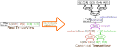

<!--
 * SPDX-FileCopyrightText: Copyright (c) 2023-present NVIDIA CORPORATION & AFFILIATES.
 * All rights reserved.
 * SPDX-License-Identifier: BSD-3-Clause
-->

# Introduction to TMA Support in NVFuser

## Introduction

TMA is a hardware feature that allows the GPU to load a tile from a tensor of up to 5D.
The tile can be dense, or strided, as shown in Figure 1 below:

When using phrases like "tile size", it is important to be clear what we are referring to.
Here we use two separate words *box* and *tile* to refer to different things.

**Definition 1**: In an N-dimensional tensor, a *box* of size `(s1, s2, ..., sN)` at
`(x1, x2, ..., xN)` refers to all the `s1*s2*...*sN` items at `(x1, x2, ..., xN)`,
`(x1, x2, ..., xN + 1)`, ..., `(x1, x2, ..., xN + sN - 1)`, ..., `(x1 + s1 - 1, x2 + s2 - 1, ..., xN + sN - 1)`.

**Definition 2**: In an N-dimensional tensor, a *tile* of size `(s1, s2, ..., sN)` and stride
`(r1, r2, ..., rN)` at `(x1, x2, ..., xN)` refers to all the `s1*s2*...*sN` items at
`(x1, x2, ..., xN)`, `(x1, x2, ..., xN + rN)`, ..., `(x1, x2, ..., xN + rN * (sN - 1))`,
..., `(x1 + r1 * (s1 - 1), x2 + r2 * (s2 - 1), ..., xN + rN * (sN - 1))`.

In Figure 1, we have box size `(6, 4)` for both diagram.
For the diagram on the left, we have tile size `(6, 4)` and stride `(1, 1)`.
For the diagram on the right, we have tile size `(6, 2)`, and stride `(1, 3)`.

Box and tile for the above example is shown below in Figure 2:

## Schedule

In order to use TMA, we need to tell the hardware what is the dimensionality of our tensor.
Most naively, we can make this dimensionality the size of the allocation domain.
This naive mental model does provide us an easy way to reason about and start using TMA,
but unfortunately it is not flexible enough and is not consistent with how we think about scheduling.
For example, if we want to schedule a fusion containing only pure pointwise (i.e. no broadcasting) operations and all input and output tensors are contiguous,
regardless of the actual dimensionality of the input and output tensors, in our mental model, we always
consider this problem as a 1D problem by viewing all tensors as flattened 1D tensor.
For this case, ideally, we should be using 1D TMA, instead of using the actual dimensionality of the tensor.
That is, the dimensionality of TMA is not necessarily the same as the dimensionality of the tensor.

In order to support the flexibility of using a dimensionality of TMA different from the dimensionality of the tensor,
we design the scheduling of TMA as a multiple-step process:

### Step 1: define TMA domain

When a user is ready to schedule the consumer of the TMA expression,
the user should already have an idea of how the problem should be viewed.
For example, if the user is scheduling a fusion with only pure pointwise ops,
the user would want to view the problem as a 1D problem.
If the user is scheduling a transpose, then the user might want to view the problem as 2D.
If the user is scheduling a matmul, then the user might want to view the problem as 3D.
From this view of the problem, the user should have an idea about what are the dimensionalities of tensors.

For example, if the user wants to schedule a matmul `(M1, M2, K1, K2, K3) x (K1, K2, K3, N) -> (M1, M2, N)`,
then in the mind of the user, this matmul will be a 3D problem `(M1*M2, K1*K2*K3, N)`.
In this mental model, the input and output tensors are all 2D:
`(M1*M2, K1*K2*K3)`, `(K1*K2*K3, N)`, and `(M1*M2, N)`.

The first step of scheduling TMA is to schedule the consumer of the TMA expression the way matching the mental model of the problem.
The result domain of this step is called the *TMA domain*.

The TMA domain for the above matmul example is shown in the Figure 3 below:

Please note that the TMA domain is not a member of a TensorDomain like the root/rFactor/allocation/leaf domains.
Instead, it is a virtual domain that only exists in the user's mind.

Also note that the IterDomain expressions between the global tensor's allocation domain and the TMA domain must be a view,
for example, we can not merge discontiguous IterDomains ([why?](../reading/divisibility-of-split.md#merging-discontiguous-iterdomains)), and we can not have indivisible splits either.

### Step 2: define box

After having scheduled a TMA domain, the next step is to define box.
There are two ways of defining box: partitioning and compositing.

#### Define box by partitioning

Defining box by partitioning is as simple as: select an IterDomain in the TMA domain, then
inner split that IterDomain by the box size of that dimension.

We call this split expression a "*boxing split*", the input of this split a "*partitioned IterDomain*",
the inner output of this split a "*box IterDomain*", and the outer output of this split a "*coordinate IterDomain*".

For the case of Figure 1, if both box dimensions are defined by partitioning,
the schedule should look like the Figure 4 below:

Please note that, although in the above example, the split is divisible, this does not have to be the case in general.

#### Define box by compositing

Define box by compositing is to select a slice of IterDomains from the TMA domain and consider the innermost IterDomain(s) in the slice as box.
The IterDomains within the slice must be contiguous to each other.
For example, if the TMA domain of a tensor is `T[I1{1024}, I2{2}, I3{4}, I4{8}]`, and the tensor is contiguous,
then we can select `[I3{4}, I4{8}]` as box IterDomains.
This defines boxes of size 32, and there are in total 2048 boxes.

It is helpful to imagine the tensor as shown in the following Figure 5:

In this mental model, `I1`, `I2`, `I3` and `I4` were first imaginarily merged to form `I5`.
Then we defined box on `I5` by partitioning.
The terms used in defining box by partitioning is also valid here,
the only difference is that these terms now refers to imaginary splits and IterDomains instead of real ones.
For convenience, we also call `[I3, I4]` "*box IterDomain*" (
Note that we never call `I3` or `I4` itself a box IterDomain,
we only call `I3` and `I4` together box IterDomain).
Similarly, we call `[I1, I2]` "*coordinate IterDomain*".

As we can see in Figure 5, when we define box by compositing,
the dimensionality of the TMA domain does not equal to the dimensionality of the TMA instruction.
Instead, the dimensionality of the imaginary TMA domain equals to the dimensionality of TMA instruction.

Note that the number of IterDomains selected as box in a slice can be arbitrary.
It can be as small as 0 IterDomains, or as large as the entire slice.
When 0 IterDomains are selected as box, the box size is implicitly one.
When the entire slice is selected as box, the tensor only have one box on that dimension, and the size of the box equals the size of that dimension.

We can use both styles of box defining at the same time in the same tensor.
For example, in Figure 6 below:

The TMA domain of the tensor has nine IterDomains.
The contiguities of these nine IterDomains are `(T, T, T, F, T, T, T, T, T)`.
We scheduled a 5D TMA operation, where in these five dimensions, one of them defines box by partitioning, and others define box by compositing.
Green color means box IterDomain and brown color means coordinate IterDomain.
The first dimension is `[I1, I2]`, where `I1` is coordinate IterDomain and `I2` is box IterDomain.
The second dimension is `I3`, it is the only dimension that defines box by partitioning.
`I3` is the partitioned IterDomain, `I11` is the box IterDomain, and `I10` is the coordinate IterDomain.
The third dimension is `I4`, it has no box IterDomain, therefore, the box size is implicitly one.
The fourth dimension is `[I5, I6]`, it has no coordinate IterDomain, therefore this dimension only has one box,
whose size is the product of the extents of `I5` and `I6`.
The fifth dimension is `[I7, I8, I9]`, where `I8` and `I9` are box IterDomain, and `I7` is coordinate IterDomain.
The imaginary TMA domain has five IterDomains, they are `merge(I1, I2)`, `I3`, `I4`, `merge(I5, I6)`, and `merge(I7, I8, I9)`.

### Step 3: define tile

TMA's tile can be dense or strided.
Most commonly, we use dense tile.
For dense tile, we define the *tile IterDomain* as the box IterDomain,
and use the word *tile* and *box* interchangeably.

For strided tile, we do an inner-split on the box IterDomain by the *element stride*.
We call this split "*striding split*", the inner output of this split "*stride IterDomain*",
and the outer output of this split "*tile IterDomain*".
For the example in Figure 1 on the right hand side, the schedule looks like the Figure 7 below:

Note that if the box is defined by compositing,
the box IterDomain can be a list of IterDomains instead of a single IterDomain.
If we want to define a strided tile in this case, we need first merge all these IterDomains to get a single box IterDomain then do the striding split.
It is wrong to just do the striding split on the innermost box IterDomain without merging them first,
and the former is not equivalent to the latter as discussed in [Divisibility of Split](../reading/divisibility-of-split.md#merge-then-split-vs-split-then-merge).

> [!WARNING]
> When the element stride does not divide and is smaller than the box size,
> and the tensor size is larger than the box size,
> extra care is needed because there are holes not filled with zero.
> This is called "**The fundamental theorem of TMA correctness**", or **FTTC** in short.
> See [TMA Modeling In Depth](../reading/tma-modeling-in-depth.md#the-unachievability-of-strong-correctness-for-indivisible-element-stride) for more detail.

### Step 4: Schedule tile

### Step 5: Schedule coordinates
