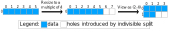
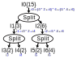
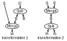

<!--
 * SPDX-FileCopyrightText: Copyright (c) 2023-present NVIDIA CORPORATION & AFFILIATES.
 * All rights reserved.
 * SPDX-License-Identifier: BSD-3-Clause
-->

# Divisibility of Split

> [!NOTE]
> We use $\div$ for true division, and $/$ for Euclidean division. For example, $5\div 2 = 2.5$, $5/2=2$.

> [!WARNING]
> In this documentation, we use Euclidean division instead of truncation division for its better mathematical properties.
> Please note that, as described in [Integer Division](../math/integer-division.md), Euclidean division is different from C++'s truncation division `/` for negative numbers.
> Today, indices and extents of all IterDomains are $\ge 0$, so we do not need to worry about the difference of variants of divisions.
> However, if in the future, we want to allow negative indices/extents, we need to make sure that our generated indices are using Euclidean division as well,
> for example, the indexing of `Merge` should be `euclideanDiv(i, N)`, and `euclideanMod(i, N)` instead of the native `i / N` and `i % N` in C++,
> otherwise some theorems in this document will fail.

## Introduction

In nvFuser, `Split` is an IterDomain expression that partitions the original IterDomain with extent $N$ into nested sub-IterDomains with extents $N_o$, $N_i$ ($N_o N_i \ge N$),
where the outer IterDomain iterates over $N_o$ and the inner IterDomain iterates $N_i$.
Typically, one of $N_o$ and $N_i$ is given by the user, and the other is computed as the `ceilDiv` of $N$ with the given extent.
The index of the original IterDomain $i$ is computed from the indices of the outputs of split $i_o$ and $i_i$ by $i = i_o \times N_i + i_i$.

For example, suppose that I have an IterDomain `I0` whose extent is `6`.
It is helpful to think of this IterDomain as the following loop:

```python
for i in range(6):
    print(i)
```

If I do a `Split(I0, 2)` on this IterDomain, I will get two IterDomains whose extents are `3` and `2`.
It is helpful to think of these two IterDomains as two nested loops:

```python
for i0 in range(3):
    for i1 in range(2):
        print(i0 * 2 + i1)
```

If the split is divisible, everything is simple and elegant like above.
However, when splits are indivisible, things start to get complicated.
For example, let's still consider the `I0` as an example.
But this time, we do a `Split(I0, 4)` instead of `Split(I0, 2)`.
With `Split(I0, 4)`, we will get two IterDomains whose extents are `2` (`ceilDiv(6, 4)`) and `4`.
These two extents can be think of as two nested loops:

```python
for i0 in range(2):
    for i1 in range(4):
        print(i0 * 4 + i1)
```

But wait, is this correct? No, this is not.
Because now we are printing `0 1 2 3 4 5 6 7` instead of `0 1 2 3 4 5`.

That is, whenever we do an indivisible split on an IterDomain, we effectively changed its range as well.
We call this added extra range "*holes*".
In the above example, the indivisible split creates two holes in `I0`.
In contrast to the concept "holes", we call the items in the original range "*valid items*".

To maintain program semantics, we must add predicates checking whether we are at a valid item or at a hole:

```python
for i0 in range(2):
    for i1 in range(4):
        i = i0 * 4 + i1
        if i < 6:
            print(i)
```

Sometimes it can be helpful to consider indivisible split as resize + divisible split.
For example, I can consider `Split(I{6}, 4)` as `DivisibleSplit(Resize(I{6}, 0, 2), 4)`.
This way, hole creation and loop transformations are separated:
`Resize(I{6}, 0, 2)` append two holes to `I{6}` to make it `I{8}`,
and `DivisibleSplit` just view the 1D valid items + holes altogether as 2D.
Visually, this is as shown in Figure 1 below:



When we iterate, we iterate on both valid items and holes.
During iteration, when we are at a hole, the index of the some IterDomain will be outside its valid interval `[start, extent)`.
When this happens, we say the index of that IterDomain is "*out of boundary*".

## Predication

As we have seen above, indivisible splits create holes in the iteration,
therefore predicates must be introduced.
Let's consider the following example in Figure 2:



In this example, there are three indivisible splits.
The indices of the inputs of all these splits, `i0`, `i1`, and `i2`, could potentially run out of boundary.

In order to maintain program semantics, the safest predication strategy is to predicate on all these three IterDomains:

```python
for i3 in range(2):
    for i4 in range(2):
        for i5 in range(2):
            for i6 in range(4):
                i1 = i3 * 2 + i4
                i2 = i5 * 4 + i6
                i0 = (i3 * 2 + i4) * 6 + (i5 * 4 + i6)
                if i1 < 3 and i2 < 6 and i0 < 15:
                    print(i0)
```

and this indeed works correctly.

Can this be simplified? What if we just predicate `i0` and nothing else?
We will get `0 1 2 3 4 5 6 7 6 7 8 9 10 11 12 13 12 13 14`.
We do print the correct set of values, but we are printing some values multiple times.
If all we care is to print the correct set of values, and we don't mind whether there are duplicates, this can be one strategy.
But this is clearly not equivalent to the program prior to transformation.

From the above example, we can see that overflow of an intermediate IterDomain does not necessarily results in an overflow of their ancestors.
To maintain program semantics, the predicate we use must be logically equivalent to predicating all holes.

The following theorems are useful tools to find mathematically simple predicates that are logically equivalent to predicating all holes:

**Theorem 1** Suppose that there is a split `I1, I2 = Split(I0)`.
Then "the indices of `I0` and `I2` are in boundary" implies "the index of `I1` is in boundary".

<details>

**<summary>Proof:</summary>**

Suppose the indices and extents of `I0`, `I1`, and `I2` are $i_0$, $i_1$, $i_2$, $N_0$, $N_1$, and $N_2$.
Then $i_0 = i_1 \times N_2 + i_2$.
"the indices of `I0` and `I2` are in boundary" means $0 \le i_0 < N_0$ and $0 \le i_2 < N_2$.

*Upper bound:*

Because $i_2 \ge 0$ and $i_0 < N_0 $, we have
$$i_1 \times N_2 < N_0$$
which is equivalent to
$$i_1 < N_0 \div N_2$$
Note that because $N_1 N_2 \ge N_0$, we have $N_0 \div N_2 \le N_1$.
Therefore,
$$i_1 < N_1$$

*Lower bound:*

Consider the Euclidean division $f(x) = x / N_2$, because $N_2 > 0$, $f(x)$ is weakly increasing.
According to Lemma 2 in `[Simplification of boolean predicates]` in `csrc/expr_simplifier.h`,
(TODO: move this theorem to a md file)
$$0 \le i_0 \implies f(0) \le f(i_0) \Leftrightarrow 0 \le i_0 / N_2$$
According to Theorem 2.15 in [Integer Division](../math/integer-division.md),
$$i_0 / N_2 = (i_1 \times N_2 + i_2) / N_2 = (i_1 \times N_2) / N_2 + i_2 / N_2$$
Because $0 \le i_2 < N_2$, we have $i_2 / N_2 = 0$.
According to Theorem 2.14 in [Integer Division](../math/integer-division.md),
$$(i_1 \times N_2) / N_2 = i_1 / (N_2 / N_2) = i_1$$
Therefore
$$i_0 / N_2 = i_1$$
That is:
$$0 \le i_0 \implies 0 \le i_1$$
$\square$

</details>

The above theorem tells us that, if we are already predicating `I0`, then there is no need to additionally predicate `I1`.
We can derive similar theorems for other IterDomain expressions:

**Theorem 2** Suppose that there is a merge `I2 = Merge(I0, I1)`.
Then "the index of `I0` is in boundary" is equivalent to "the index of `I2` is in boundary".

<details>

**<summary>Proof:</summary>**

Suppose the index of `I2` is $i_2$, the extent of `I1` is $N_1$.
Then the index of `I0` is $i_0 = i_2 / N_1$.
Suppose that the extents of `I0` and `I2` are $N_0$ and $N_2$, then $N_2 = N_0 \times N_1$.
"the index of `I0` is in boundary" means $0 \le i_0 < N_0$

*Lower bound:*

Because $N_1 > 0$, it is a property of Euclidean division that $i_2 / N_1 \ge 0 \Leftrightarrow i_2 \ge 0$. See:

> Boute, Raymond T. "The Euclidean definition of the functions div and mod." ACM Transactions on Programming Languages and Systems (TOPLAS) 14.2 (1992): 127-144.

Note that truncation division does not have this property.

*Upper bound:*

According to Theorem 2.16 in [Integer Division](../math/integer-division.md),
$$i_2 / N_1 < N_0 \Leftrightarrow i_2 < N_0 \times N_1 \Leftrightarrow i_2 < N_2$$
$\square$

</details>

**Theorem 3** Suppose that there is a resize `I1 = Resize(I0, L, R)`.
Then "the index of `I0` is in boundary" implies "the index of `I1` is in boundary" if $L \ge 0$ and $R \ge 0$.

<details>

**<summary>Proof:</summary>**

Suppose the index of `I1` is $i_1$, the extent of `I0` is $N_0$.
The index of `I0` is then $i_0 = i_1 - L$.
The extent of `I1` is $N_0 + L + R$.
"the index of `I0` is in boundary" means $0 \leq i_0 < N_0$.

*Lower bound:*

Because $L \ge 0$,
$$i_0 \ge 0 \Leftrightarrow i_1 \ge L \implies i_1 \ge 0$$

*Upper bound:*

Because $R \ge 0$,
$$i_0 < N \Leftrightarrow i_1 < N_0 + L \implies i_1 < N + L + R$$
$\square$

</details>

**Theorem 4** Suppose that there is a swizzle `I2, I3 = Swizzle(I0, I1)`.
Then "the index of `I0` is in boundary" is equivalent to "the index of `I2` is in boundary".

<details>

**<summary>Proof:</summary>**

`I0` and `I2` also have the same extents and indices.
$\square$

</details>

## Allocation and correctness model

Indivisible split also impact the allocation size.

For example, if I have a tensor `T0[I0{6}]`, when allocating this tensor,
I will allocate 6 items for this tensor.
If I do an indivisible split on `I0{6}` by `4` to get `I1{2}` and `I2{4}`,
and set the allocation domain of this tensor as `[I1, I2]`,
then I will need to allocate `2*4 = 8` items.

We call the above situation *over-allocated*, that is,
we are not only allocating valid items, but also allocating holes.

Because there are holes in the allocation due to indivisible split,
a natural question to ask is: When we write to an over-allocated buffer,
what value should we fill these holes as?
Possible answers are:

1. As long as there is no "Illegal Memory Access" killing my kernel,
   I don't care about what values these holes have.
2. The holes should be filled with 0.
3. The holes should be filled with x (something different from zero).

Which answer is correct? There is no certain answer.
It totally depends on how these values are read:
If the holes are never read, then 1, 2, or 3 makes no difference.
If the holes are actually read,
then it needs to be filled with some neutral value that effectively leads to a no-op.
For example, if we are doing an unpredicated reduction on an over-allocated buffer,
such as when using tensor core, we must fill the holes correctly.
If the reduction is sum, then the holes must be filled with 0.
If the reduction is product, then the holes must be filled with 1.
This inspires the concept of weak and strong correctness:

**Definition 1:** A schedule/lowering strategy is weakly correct if all the valid items in the consumer's allocation domain are filled with the correct value,
and there is no error raise in the kernel.

**Definition 2:** A schedule/lowering strategy is strongly correct if all the valid items in the consumer's allocation domain are filled with the correct value,
and all holes are filled with a desired filling value.

## Properties of split

### Merge-then-split vs split-then-merge

**Theorem 5:** Suppose that there are two IterDomains `I1` and `I2`,
the following two combinations of merge and split in the Figure 3 below are equivalent if and only if the split is divisible



<details>

**<summary>Proof:</summary>**

*If the split is indivisible, these two transformations are not equivalent:*

We can see this from a simple example where there is a tensor `T[I1, I2]`,
`I1` has extent `2`, `I2` has extent `5`, and `N` is `4`.

For transformation 1, after schedule, the extents of the loop domain `[I4, I5]` will be `[2*2, 4]`.
We will be iterating the tensor as the following Listing 1:

<!-- CI IGNORE -->
```python
T[0, 0], T[0, 1], T[0, 2] , T[0, 3]
T[0, 4], T[0, 5], T[0, 6] , T[0, 7]
T[1, 0], T[1, 1], T[1, 2] , T[1, 3]
T[1, 4], T[1, 5], T[1, 6] , T[1, 7]
```

For transformation 2, after schedule, the extents of the loop domain `[I4, I5]` will be `[3, 4]`.
We will be iterating the tensor as as the following Listing 2:

<!-- CI IGNORE -->
```python
T[0, 0], T[0, 1], T[0, 2] , T[0, 3]
T[0, 4], T[1, 0], T[1, 1] , T[1, 2]
T[1, 3], T[1, 4], T[2, 0] , T[2, 1]
```

They are clearly not equivalent.

*If the split is divisible, the two transformations are equivalent:*

Let's say the extents of `I1` and `I2` are $N_1$ and $N_2$, and the split size is $N$.
Being divisible means $N$ divide $N_2$.

The extent of `I4` of transformation 1 is $N_1 \times (N_2 \div N)$,
which is the same as transformation 2's `I4`'s extent $(N_1 \times N_2) \div N$.
The extents of `I5` in transformations 1 and 2 are all $N$.

Assume the indices of `I4` and `I5` are $i$ and $j$.

In schedule 1, the indices of `I1` and `I2` are
$i/(N_2 / N)$ and $i \mathbin{\\%} (N_2 / N) \times N + j$.
According to Theorem 2.10 in [Integer Division](../math/integer-division.md),
$$i/(N_2 / N) = (i \times N) / N_2$$
According to Theorem 2.13 in [Integer Division](../math/integer-division.md),
$$i \mathbin{\\%} (N_2 / N) \times N + j = (i \times N) \mathbin{\\%} N_2  + j$$

In schedule 2, the indices of `I1` and `I2` are
$(i \times N + j) / N_2$ and $(i \times N + j) \mathbin{\\%} N_2$.
According to Theorem 2.7.2, 2.15.2 in [Integer Division](../math/integer-division.md),
$$(i \times N + j) / N_2 = (i \times N) / N_2$$
$$(i \times N + j) \mathbin{\\%} N_2 = (i \times N) \mathbin{\\%} N_2  + j$$

We can see that `I1` and `I2` has the same indices, they are therefore equivalent.
$\square$

</details>

### Merging discontiguous IterDomains

#### Question

- Q1: Can I merge two discontiguous IterDomains to create a larger IterDomain, and split out a vectorization IterDomain from this larger IterDomain?
- Q2: In TMA scheduling, can I create the TMA domain by merging two discontiguous IterDomains, and then split out a box?

#### Answer

The answer is yes if and only if the split size divide the extent of the inner IterDomain of the merge.

If we merge discontiguous IterDomains then do a split that does not divide the inner extent,
we will end up iterating the tensor like transformation 2 in the [above example](#merge-then-split-vs-split-then-merge).
From the Listing 2 there, we see that after `T[0, 4]`, we should be accessing `T[1, 0]`,
which is not contiguous to `T[0, 4]` in memory.
However, vectorization and TMA can only access memory contiguously.

If divisible, then the merge-then-split is equivalent to a split-then-merge, which is totally valid.
