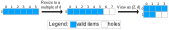

<!--
 * SPDX-FileCopyrightText: Copyright (c) 2023-present NVIDIA CORPORATION & AFFILIATES.
 * All rights reserved.
 * SPDX-License-Identifier: BSD-3-Clause
-->

# Divisibility of Split

> [!NOTE]
> We use $\div$ for true division, and $/$ for integer division. For example, $5\div 2 = 2.5$, $5/2=2$.

## Introduction

In nvFuser, `Split` is an IterDomain expression that partitions the original IterDomain into nested sub-IterDomains,
where the outer IterDomain iterates over the quotient and the inner IterDomain iterates over the remainder of the original extent divided by the split factor.

For example, suppose that I have an IterDomain whose extent is `6`.
It is helpful to think of this IterDomain as the following loop:

```python
for i in range(6):
    print(i)
```

If I do a `Split(2)` on this IterDomain, I will get two IterDomains whose extents are `3` and `2`.
It is helpful to think of these two IterDomains as two nested loops:

```python
for i0 in range(3):
    for i1 in range(2):
        print(i0 * 2 + i1)
```

If the split is divisible, everything is simple and elegant like above.
However, when splits are indivisible, things start to get complicated.
For example, let's still consider the IterDomain with extent `6` in the example.
But this time, we do a `Split(4)` instead of `Split(2)`.
With `Split(4)`, we will get two IterDomains whose extents are `2` (`ceilDiv(6, 4)`) and `4`.
These two extents can be think of as two nested loops:

```python
for i0 in range(2):
    for i1 in range(4):
        print(i0 * 4 + i1)
```

But wait, is this correct? No, this is not.
Because now we are printing `0 1 2 3 4 5 6 7` instead of `0 1 2 3 4 5`.
The correct code should be:

```python
for i0 in range(2):
    for i1 in range(4):
        i = i0 * 4 + i1
        if i < 6:
            print(i)
```

That is, whenever we do an indivisible split on an IterDomain, we will index out-of-bound for that IterDomain.
Therefore, we must generate a predicate for the IterDomain being split.

Personally, I feel it helpful to consider indivisible split as resize + divisible split.
For example, I can consider `Split(I{6}, 4)` as `DivisibleSplit(Resize(I{6}, 0, 2), 4)`.
This way, `DivisibleSplit` just converts one loop into two loops without hurting the correctness,
and `Resize(I{size1}, 0, right_expand)` converts a

```python
for i in range(size1):
    print(i)
```

into

```python
for i in range(size1 + right_expand):
    if i < size1:
        print(i)
```

## Predication

As we have seen in the above example, indivisible split introduces predicate on the IterDomain being split.
Let's consider the following example in Figure 1:


I1, I2 = split(I0)
I3, I4 = split(I1)
I5, I6 = split(I2)

In this example, there are two indivisible splits, and we need to predicate `I0` and `I1`.
But is it really necessary to predicate both? No, it is not:

**Theorem 1** Suppose that there is a split `I1, I2 = Split(I0, N)`.
Then "the index of `I0` is in bound" implies "the index of `I1` is in bound".

**Proof:** Suppose the index of `I1` is $i_1$, the index of `I2` is $i_2$, the extent of `I0` is $S$.
The index of `I0` is then $i_0 = i_1 \times N + i_2$.
"the index of `I0` is in bound" means $i_0 < S$.
Because $i_2 \ge 0$,
$$i_0 < S \implies i_1 \times N < S \implies i_1 < S \div N \implies i_1 < \mathrm{ceilDiv}(S, N)$$
$\square$

The above theorem tells us that, if we are already predicating `I0`, then there is no need to additionally predicate `I1`.
We can derive similar theorems for other IterDomain expressions:

**Theorem 2** Suppose that there is a merge `I2 = Merge(I0, I1)`.
Then "the index of `I0` is in bound" is equivalent to "the index of `I2` is in bound".

**Proof:** Suppose the index of `I2` is $i_2$, the extent of `I1` is $N$.
Then the index of `I0` is $i_0 = i_2 / N$.
Suppose that the extents of `I0` and `I2` are $P$ and $Q = N \times P$.
"the index of `I0` is in bound" means $i_0 < P$, which is:
$$i_2 / N < P$$
According to "Rule 1" in `[Simplification of boolean predicates]` in `csrc/expr_simplifier.h`,
(TODO: move this theorem to a md file)
$$i_2 / N < P \Leftrightarrow i_2 < Q$$
$\square$

**Theorem 3** Suppose that there is a resize `I1 = Resize(I0, L, R)`.
Then "the index of `I0` is in bound" implies "the index of `I1` is in bound" if $R >= 0$.

**Proof:** Suppose the index of `I1` is $i_1$, the extent of `I0` is $N$.
The index of `I0` is then $i_0 = i_1 - L$.
The extent of `I1` is `N + L + R`
"the index of `I0` is in bound" means $i_0 < N$.
Because $R \ge 0$,
$$i_0 < N \Leftrightarrow i_1 < N + L \implies i_1 < N + L + R$$
$\square$

**Theorem 4** Suppose that there is a swizzle `I2, I3 = Swizzle(I0, I1)`.
Then "the index of `I0` is in bound" is equivalent to "the index of `I2` is in bound".

**Proof:** Suppose the index of `I2` is $i_2$.
The index of `I0` is the same as `I2`: $i_0 = i_2$.
`I0` and `I2` also have the same extent.
$\square$

## Allocation and correctness model

Indivisible split also impact the allocation size.

For example, if I have a tensor `T0[I0{6}]`, when allocating this tensor,
I will allocate 6 items for this tensor.
If I do an indivisible split on `I0{6}` by `4` to get `I1{2}` and `I2{4}`,
and set the allocation domain of this tensor as `[I1, I2]`,
then I will need to allocate `2*4 = 8` items.
With the mental model of considering indivisible split as resize + divisible split,
we can consider the allocation of this example as Figure 2:



We call the above situation *over-allocated*.

Because there are holes in the allocation due to indivisible split,
a natural question to ask is: When we write to an over-allocated buffer,
what value should we fill these holes as?
Possible answers are:

1. As long as there is no "Illegal Memory Access" killing my kernel,
   I don't care about what values these holes have.
2. The holes should be filled with 0.
3. The holes should be filled with x (something different from zero).

Which answer is correct? There is no certain answer.
It totally depends on how these values are read:
If the out-of-bound items are never read, then 1, 2, or 3 makes no difference.
If the out-of-bound items are actually read,
then it needs to be filled with some neutral value that effectively leads to a no-op.
For example, if we are doing an un-predicated reduction on an over-allocated buffer,
such as when using tensor core, we must fill the out-of-bound items correctly.
If the reduction is sum, then the out-of-bound items must be filled with 0.
If the reduction is product, then the out-of-bound items must be filled with 1.

We call 1 "*weak correctness*", and 2 and 3 "*strong correctness*".

TODO: more thorough definition

## Case studies

If I have a tensor `T0[I1, I2]`, are the following two schedules equivalent?

- **Schedule 1:** `[I1, I2] -- split -> [I1, I2/4, 4] -- merge -> [I1*(I2/4), 4]`.
- **Schedule 2:** `[I1, I2] -- merge -> [I1*I2] -- split -> [(I1*I2)/4, 4]`.

Where the divisions above are all ceildiv.

If the split is indivisible, the answer is no.
We can see this from a simple example where `I1` has extent `2`, and `I2` has extent `5`.

For schedule 1, after schedule, the extents of the leaf domain will be `[2*2, 4]`.
So for this schedule, we will be iterating the tensor as:

```python
T[0, 0], T[0, 1], T[0, 2] , T[0, 3]
T[0, 4], T[0, 5], T[0, 6] , T[0, 7]
T[1, 0], T[1, 1], T[1, 2] , T[1, 3]
T[1, 4], T[1, 5], T[1, 6] , T[1, 7]
```

For schedule 2, after schedule, the extents of the leaf domain will be `[3, 4]`.
So for this schedule, we will be iterating the tensor as:

```python
T[0, 0], T[0, 1], T[0, 2] , T[0, 3]
T[0, 4], T[1, 0], T[1, 1] , T[1, 2]
T[1, 3], T[1, 4], T[2, 0] , T[2, 1]
```

They are clearly not equivalent.

What if the split is divisible? They are equivalent!

TODO: explain why?

## Implications

### Merging discontiguous IterDomains

- Q1: Can I merge two discontiguous IterDomains to create a larger IterDomain, and split out a vectorization IterDomain from this larger IterDomain?
- Q2: In TMA scheduling, can I create the TMA domain by merging two discontiguous IterDomains, and then split out a box?

The answer is: yes if and only if the split size divide the extent of the inner IterDomain of the merge.
If we merge discontiguous IterDomains then do a split that does not divide the inner extent,
we will end up iterating the tensor like schedule 2.
From the above listing, we see that after `T[0, 4]`, we should be accessing `T[1, 0]`,
which is not contiguous to `T[0, 4]` in memory.
However, vectorization and TMA can only access memory contiguously.

TODO: what if divisible?
