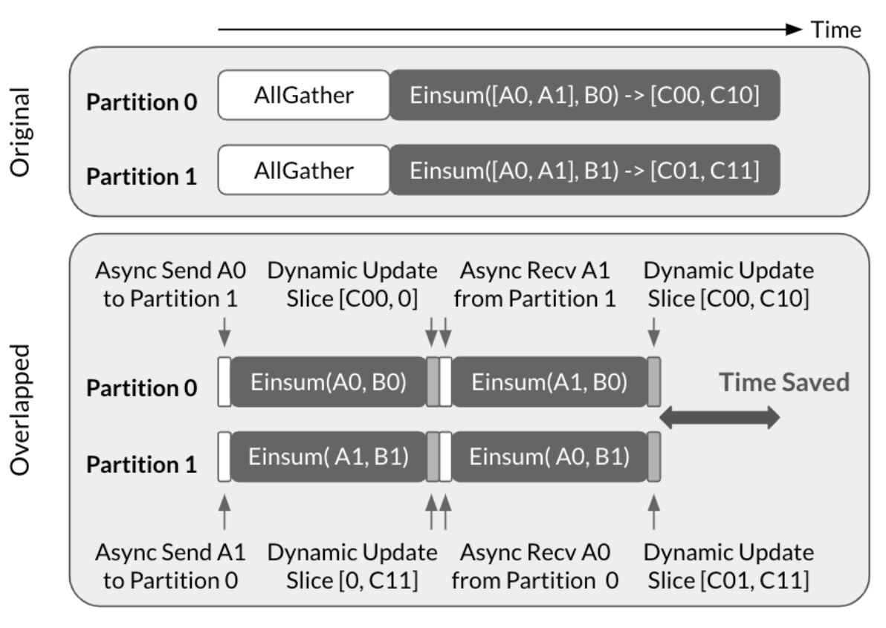

<!--
 * SPDX-FileCopyrightText: Copyright (c) 2025-present NVIDIA CORPORATION & AFFILIATES.
 * All rights reserved.
 * SPDX-License-Identifier: BSD-3-Clause
-->

# Multi-GPU Support in nvFuser

## Introduction

A key strength of nvFuser has been its ability to automatically optimize CUDA
kernels by parallelizing them across threads and blocks. This is achieved by
cleanly separating the *definition* of what to compute from the *schedule* that
determines how to execute it efficiently.

We believe this principle extends naturally from single-GPU to multi-GPU
workloads. For instance, online softmax has been the core idea behind
FlashAttention for single-GPU and context parallelism for multi-GPU. Programmers
also strive to overlap communication and GEMMs, much like overlaping TMA
loads/stores with tensor-core operations.

Therefore, since 2024, we have been generalizing these representations and
algorithms -- originally built for single-GPU execution -- to enable efficient
parallelization of deep learning workloads across multiple GPUs.

## User API

The following example demonstrates how to run a distributed GPT-3 style MLP
block using nvFuser's multi-GPU API.

```python
def define_fusion(fd: FusionDefinition):
    inp = fd.define_tensor([-1, -1, h])
    up_w = fd.define_tensor([h * 4, h])
    out = fd.ops.linear(inp, up_w)

    # `gelu` runs a series of pointwise operations. For simplicity, I omit the
    # details and treat it as one pointwise operation.
    out = gelu(out)

    down_w = fd.define_tensor([h, h * 4])
    out = fd.ops.linear(out, down_w)

    fd.add_output(out)

inp_dtensors: list[DTensor]
fdw = FusionDefinitionWrapper(define_fusion)
out_dtensors: list[DTensor] = fdw(inp_dtensors)
```

A user initializes a
[`FusionDefinitionWrapper`](https://github.com/NVIDIA/Fuser/blob/84c46fed9256b94c4eb9c7aa7f5757056dc88783/tests/python/multidevice/fusion_definition_wrapper.py#L21)
with a **single-GPU** fusion definition. Then, they can invoke it with a list of
three `DTensor` objects -- corresponding to the input activations, the
up-projection weights, and the down-projection weights. The result is a list
containing a single `DTensor` that represents the output activations of the MLP
block.

Under the hood, nvFuser derives a **multi-GPU** schedule from the definition and
the input DTensors, then executes that schedule across multiple GPUs. This
automatically handles sharding and communication and therefore removes the need
for users to explicitly orchestrate communications such as
`torch.distributed.all_reduce`.

By default, nvFuser strives to generate an efficient schedule automatically.
However, for performance-critical workloads, we plan to let users guide
scheduling by providing partial schedules for selected intermediate and/or
output `TensorView`s. This can be done through the scheduling Python API, using
primitives such as `TensorView.split` and `IterDomain.parallelize`.

## Parallelisms

This section goes through several common parallelisms and see how they can be
represented and implemented in fusion IR. For simplicity, I'm going to use the
above MLP block as the running example. However, these parallelisms can often be
applied other parts of a Transformer model such as MHA, RMSNorm and embedding
layers.

### Tensor Parallelism

To apply [tensor
parallelism](https://docs.nvidia.com/nemo-framework/user-guide/latest/nemotoolkit/features/parallelisms.html#tensor-parallelism),
the user calls the `FusionDefinitionWrapper` with the following DTensors:
* `inp` with placement `Replicated()`
* `up_w` with placement `Shard(0)`
* `down_w` with placement `Shard(1)`

Therefore, nvFuser starts with the following fusion IR:
```
 inp: [t, h]                          up_w: [4h,  h]
                                             /\
                                            d
                        |
                        | linear
                        |
                     [t, 4h, r{h}]
                        |
                        | gelu
                        |
                     [t, 4h]                down_w: [h, 4h]
                                                        /\
                                                       d
                                       |
                                       | linear
                                       |
                                  [t, h, r{4h}]
```

Then, nvFuser propagates shardings from inputs to outputs:
```
 in: [t, h]                           up_w: [4h,  h]
                                             /\
                                            d
                        |
                        | linear
                        |
                     [t, 4h, r{h}]
                         /\.
                        d
                        |
                        | gelu
                        |
                     [t, 4h]                down_w: [h, 4h]
                         /\                             /\
                        d                              d
                                       |
                                       | linear
                                       |
                                  [t, h, r{4h}]
                                           /\
                                        r{d}
```

Then, nvFuser decomposes every Expr that does both computation and communication
so every Expr can be lowered to either host IR or kernel IR. In the above fusion
IR, the second `linear` does both intra-GPU GEMM and inter-GPU reduction.
Therefore, after decomposition, the fusion IR becomes:
```
 in: [t, h]                           up_w: [4h,  h]
                                             /\
                                            d
                        |
                        | linear
                        |
                     [t, 4h, r{h}]
                         /\.
                        d
                        |
                        | gelu
                        |
                     [t, 4h]                down_w: [h, 4h]
                         /\                             /\
                        d                              d
                                       |
                                       | linear
                                       |
                               [t, h, d, r{4h/d}]
                                       |
                                       | sum
                                       |
                                  [t, h, r{d}]
```

This fusion IR then goes through segmentation, (intra-GPU) scheduling, device
lowering, and host IR lowering. Eventually, the `linear`s and the `gelu` become
CUDA kernels and the `sum` becomes a call to `ncclAllReduce`.

### Sequence Parallelism

[Sequence
parallelism](https://docs.nvidia.com/nemo-framework/user-guide/latest/nemotoolkit/features/parallelisms.html#sequence-parallelism)
extends tensor parallelism by sharding not just the weights but also input and
output activations.

To apply sequence parallelism, the user calls the `FusionDefinitionWrapper` with the following DTensors:
* `inp` with placement `Shard(0)`
* `up_w` with placement `Shard(0)`
* `down_w` with placement `Shard(1)`

Therefore, nvFuser starts with the following fusion IR:
```
 inp: [t, h]                          up_w: [4h,  h]
      / \                                    /\
     d                                      d
                        |
                        | linear
                        |
                     [t, 4h, r{h}]
                        |
                        | gelu
                        |
                     [t, 4h]                down_w: [h, 4h]
                                                        /\
                                                       d
                                       |
                                       | linear
                                       |
                                  [t, h, r{4h}]
```

Then, nvFuser propagates shardings:
```
 inp: [t, h]                          up_w: [4h,  h]
      / \                                    /\
     d                                      d
                        |
                        | linear
                        |
                     [t, 4h, r{h}]
                         /\
                        d
                        |
                        | gelu
                        |
                     [t, 4h]                down_w: [h, 4h]
                         /\                             /\
                        d                              d
                                       |
                                       | linear
                                       |
                                  [t, h, r{4h}]
                                  / \      /\
                                 d      r{d}
```

When nvFuser propagates shardings through the first `linear`, it can choose to
either follow `inp`'s sharding and split `t` by `d` or follow `up_w` and split
`4h` by `d`. Currently, our implementation chooses to follow `up_w` so weights
(usually larger than activations) don't have to be redistributed.

The output's `t` is split by `d`. nvFuser wouldn't do this automatically if it
runs the MLP block alone. However, in practice, the MLP block is followed by a
residual connection. Therefore, `t` being split by `d` can be **back**
propagated from that residual connection.

Then, nvFuser decomposes every Expr that does both computation and
communication. There are two of them:
1. The first `linear` redistributes `inp` and runs a GEMM.
2. The second `linear` runs a GEMM and redistributes the output.

Therefore, after decomposition, the fusion IR becomes:
```
 inp: [t, h]
      / \
     d
     |
     | set
     |
      [t, h]                          up_w: [4h,  h]
                                             /\
                                            d
                        |
                        | linear
                        |
                     [t, 4h, r{h}]
                         /\
                        d
                        |
                        | gelu
                        |
                     [t, 4h]                down_w: [h, 4h]
                         /\                             /\
                        d                              d
`                                      |
                                       | linear
                                       |
                               [t, h, d, r{4h/d}]
                                       |
                                       | sum
                                       |
                                  [t, h, r{d}]
                                  / \
                                 d
```

This fusion IR then goes through the rest of the nvFuser stack. The `set`
becomes a call to `ncclAllGather` and the `sum` becomes a call to
`ncclReduceScatter`.

### Overlap communication with GEMM via Decomposition

[This orthogonal technique](https://dl.acm.org/doi/10.1145/3567955.3567959) can
be applied to many parallelisms (e.g. sequence parallelism, tensor parallelism
and context parallelism) to reduce latency. Instead of sequentially running
communication operations (e.g. Allgather and ReduceScatter) and computation
operations (e.g. GEMM), the technique reduces wall time by decomposing these
operations and overlapping communication with computation.



> **Figure 1.** Overlap allgather with GEMM[^1]

[^1]: Wang et al., *Overlap Communication with Dependent Computation via Decomposition in Large Deep Learning Models*, ASPLOS 2023. [https://dl.acm.org/doi/pdf/10.1145/3567955.3567959]

There are two types of decomposition:
* Collective-based. A large communication collective is decomposed into collectives of the same nature.
* Ring-based. A large communication collective is decomposed into circular-shift point-to-point communications.

The tradeoffs are:
* Collective-based exposes a fine-grained communication to the critical path.
* Collective-based is easier to implement in nvFuser because it doesn't involve circular shift.
* Ring-based decomposition requires the number of chunks to be a multiple of the number of devices, whereas collective-based decomposition doesn't.
* Ring-based decomposition supports canonical layouts better.

[This
test](https://github.com/NVIDIA/Fuser/blob/main/tests/cpp/test_overlap.cpp#L57)
shows how the fusion IR represents an overlapped allgather with GEMM using
ring-based decomposition.

### Data Parallelism

TODO: DDP and FSDP

### Pipeline Parallelism

TODO: DeviceMesh, Stream parallel type, and stream lowering

### Context Parallelism

TODO
