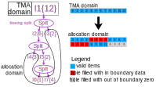
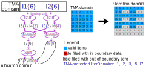
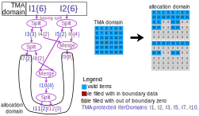
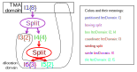
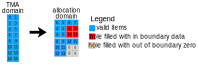

<!--
 * SPDX-FileCopyrightText: Copyright (c) 2023-present NVIDIA CORPORATION & AFFILIATES.
 * All rights reserved.
 * SPDX-License-Identifier: BSD-3-Clause
-->

# TMA Modeling In Depth

> [!NOTE]
> We use $\div$ for true division, and $/$ for TODO Euclidean division. For example, $5\div 2 = 2.5$, $5/2=2$.

This document means to provide a deeper insight into how we model TMA, primarily at IterDomain level.
This document is not an introduction to our TMA support, which can be found [here](../dev/tma.md).
This document does not discuss topics like hardware, performance, computer architecture, etc.,
instead, we focus on mathematical correctness of our modeling here.
This document assumes familarity with the [introduction doc](../dev/tma.md) and ["Divisibility of Split"](../reading/divisibility-of-split.md).

We will focus on tiled TMA here, im2col TMA is not supported yet.

## What is TMA?

TMA is a hardware feature that allows the GPU to load a tile from a tensor of up to 5D.
The tile can be dense, or strided, as shown in Figure 1 below (the same figure as in the [introduction doc](../dev/tma.md)):


Conceptually, we can consider TMA as a function:
> $\mathrm{tma}(\vec{x}, sa; ga, \vec{gs}, \vec{bs}, \vec{gr}, \vec{er}, op)$.

In the parameter list of the above function signature,
we intentionally used `;` instead of `,` to separate $sa$ with $ga$.
we call everything before `;` "inputs", and everything after `;` except $op$ "parameters".

The meanings of inputs, parameters, and $op$ are:

- $op$ defines the direction of transfer, it can be either "load" (global -> shared) or "store" (shared -> global).
- $\vec{x}$ is the N-dimensional coordinate of the starting of the box in tensor.
  In the example in Figure 1, it is $(9, 1)$.
- $sa$ stands for "Shared memory base Address".
  In the example in Figure 1, it is the address of the purple item on the top left cornor of the box in shared memory.
- $ga$ stands for "Global memory base Address".
  In the example in Figure 1, it is the address of the blue item on the top left cornor of the tensor in global memory.
- $\vec{gs}$ stands for "Global Size". It is a vector of the same dimensionality as $\vec{x}$.
  In the example in Figure 1, it is $(12, 16)$.
- $\vec{bs}$ stands for "Box Size". It is a vector of the same dimensionality as $\vec{x}$.
  In the example in Figure 1, it is $(6, 4)$.
- $\vec{gr}$ stands for "Global stRide". It is a vector of the same dimensionality as $\vec{x}$.
  In the example in Figure 1, it is $(1, 14)$.
- $\vec{er}$ stands for "Element stRide". It is a vector of the same dimensionality as $\vec{x}$.
  In the example in Figure 1, it is $(1, 1)$ for the left diagram, and $(1, 3)$ for the right diagram.

We call inputs, parameters, and $op$ differently because in the implementation,
inputs are provided as operands for the PTX instruction,
parameters are encoded inside the TensorMap descriptor,
and $op$ defines which PTX instruction to use.
When looking at the kernel level, only $\vec{x}$ and $sa$ can change;
parameters and op are predefined constants.

The thing that this $tma$ function does is demonstrated in the CodeBlock 1 below
(here, assuming the TMA is 2D, we can easily generalize to other dimensionalities):

```python
def tma(x, sa, *, ga, gs, bs, gr, er, op):
    ts = [ceildiv(bs[0], er[0]), ceildiv(bs[1], er[1])] # tile size
    for i0 in range(ts[0]):
        for i1 in range(ts[1]):
            smem_idx = i1 * ts[0] + i0
            gmem_idx0 = x[0] + i0 * er[0]
            gmem_idx1 = x[1] + i1 * er[1]
            gmem_idx = gmem_idx0 * gr[0] + gmem_idx1 * gr[1]
            if op == "load":
                if gmem_idx0 < gs[0] and gmem_idx1 < gs[1]:
                    sa[smem_idx] = ga[gmem_idx]
                else:
                    sa[smem_idx] = 0
            else:
                if gmem_idx0 < gs[0] and gmem_idx1 < gs[1]:
                    ga[gmem_idx] = sa[smem_idx]
```

## Predication and correctness

We all know that TMA has built-in boundary check and automatic zero filling for out-of-boundary items.
But what does this mean? Does it mean that we don't need to predicate a TMA expression at all?
Does it mean that we don't need to initialize the output buffer of TMA?
This section discusses these questions.

First to note is, what we should do depend on how we will use the output of TMA.
The theory for this is called [correctness model](divisibility-of-split.md#allocation-and-correctness-model).
Specifically, we are interested in:

- For an unpredicated TMA expression, if we do not initialize the buffer, what correctness model can we achieve? Depending on the schedule, the answer can be different:
  - What schedule can achieve weak correctness?
  - What schedule can achieve strong correctness?
- In the case where strong correctness is needed, but we have only achieved weak correctness,
  is there any way to upgrade to strong correctness by doing something?

As we can see from CodeBlock 1, TMA has builtin predicates checking that the indices of all partitioned IterDomains are in boundary.
That is, TMA will never do out-of-boundary access on global memory even if the indices of
some IterDomains may be out of boundary.
Therefore, we have:

**Theorem 1:** TMA provides weak correctness regardless of how we schedule, how we initialize the buffer, and how we generate predicates.

Having weak correctness is great in the sense that,
if weak correctness is sufficient for us,
we neither need to predicate nor need to initialize the output of TMA to achieve correct functionality.

The following example Figure 2 shows a schedule of the consumer of a TMA load.
From this figure, we can see that, if no additional predicate is used to guard the TMA load expression,
some holes in allocation domain will be filled with in boundary data,
and some holes will be filled with out of boundary zeros:



A common use case for TMA is to load data for tensor core.
Because tensor core has unpredicated reduction,
we want to make sure all holes are filled with zeros so that it has no contribution to the final result.
This would require our TMA scheduling and lowering strategy to achieve strong correctness.
In order to achieve strong correctness, we need to make sure that all holes lead to false in TMA's builtin predicate,
so that TMA knows these holes should be filled with zero instead of load some data from global memory to fill it,
and red items in Figure 2 are not allowed.
That is, in the consumer tensor of TMA load,
the indices of all IterDomains between the TMA domain and allocation domain should either never go out of boundary (for example, if they are never transformed further, or all their descendants are never resized or indivisibly split) or logically implied by TMA's builtin predicates.
This leads to the following definition:

**Definition 1 (TMA-protected IterDomain):** An IterDomain is TMA-protected if it satisfies any of the following conditions:

1. It is a partitioned IterDomain.
2. It is the outer output of a split of a TMA-protected IterDomain.
3. It is the output of a merge whose outer input is a TMA-protected IterDomain.
4. It is the output of a resize whose input is a TMA-protected IterDomain and `left_expand >= 0 && right_expand >= 0`.
5. It is the `X` output of a swizzle whose `X` input a TMA-protected IterDomain.

TMA-protected IterDomain has the following very important property:

**Theorem 4:** If non-TMA-protected IterDomains are in boundary,
then "TMA's builtin predicates are satisfied" implies "the indices of all TMA-protected IterDomains are in boundary".

<details>

**<summary>Proof:</summary>**

It is easy to see that the above rules 2-5 maps to Theorem 1-4 in ["Divisibility of Split"](../reading/divisibility-of-split.md#predication),
except that Theorem 1 has an additional requirement for `I2` being in bound,
which is guaranteed by the statement "if non-TMA-protected IterDomains are in boundary".
$\square$

</details>

With the above theorem, we can easily see that,
if non-TMA-protected IterDomains are in boundary,
when any of the indices of TMA-protected IterDomains goes out of boundary,
some partitioned IterDomain's index will also go out of boundary.
Therefore, TMA will use zero to fill these regions.
That is:

**Theorem 5:** A consumer schedule of TMA load provides strong correctness if
the input IterDomains of all hole-creating expressions between the allocation domain and the TMA domain are TMA-protected,
and the desired filling value is 0.

Having strong correctness means that all the out-of-boundary items are filled with zero,
and cases like Figure 2 could not happen.

An example of strong correctness is shown in the following Figure 3:



In this figure, `I2` and `I7` are the only IterDomains that could run out of boundary,
they are both TMA-protected. So we can achieve strong correctness.

Another example is the following Figure 4:



In this figure, `I2`, `I3` and `I10` are the only IterDomains that could run out of boundary,
they are all TMA-protected. So we can achieve strong correctness.

TODO: explain how to upgrade weak correctness to strong correctness by initializing and predicating?

## The unachievability of strong correctness for indivisible element stride

Let's take a look at the example in the following Figure 5:



TMA-protected IterDomains are `I1`, `I2`, and `I3`.
We can see that `I4` is indivisibly split but not TMA-protected,
so there exist out-of-boundary index of `I4` that is not eventually translated to out-of-boundary index of `I1`.
For example, let $i_3$, $i_4$, and $i_1$ be the indices of `I3`, `I4`, and `I1`,
if $i_3 = 0$ and $i_4 = 4$, then $i_1 = 4$ is an in-boundary value.
To make it even worse, the index of `I4` depends on the index of `I5`,
which is hardware parallelized and the programmer has no access to,
so it is not even possible to write a `if` check for the boundary of `I4`.
For this example, the data loaded in shared memory looks like the following Figure 6:



From the above figure, we see that there are two tiles where the first half tile is blue and the second half tile is red.
However, the granularity on TMA that programmer has control of is per tile.
There is no way for a programmer to tell the hardware that they want part of a tile to be filled with data but part of it filled with zero even if they are not out of boundary.

The above observation leads to the following theorem:

**Theorem 6:** It is impossible to achieve strong correctness if and only if there exist a dimension that satisfies all of the following conditions:

1. The element stride does not divide and is smaller than the box size on that dimension.
2. The box size is smaller than the tensor size on that dimension.

<details>

**<summary>Proof:</summary>**

Consider a dimension, let's define some notation first:

- size of dimension: $S \in \mathbb{Z}^+$
- box size: $B \in \mathbb{Z}^+$
- element stride: $e \in \mathbb{Z}^+$
- index of the partitioned ID: $i_p$
- index of the coordinate ID: $i_c$
- index of the box ID: $i_b$
- index of the tile ID: $i_t$
- index of the stride ID: $i_s$

Then we have:
$$i_b = i_t * e + i_s$$
$$i_p = i_c * B + i_b$$

The builtin predicate for TMA is:
$$0 \le i_p < S$$

If this dimension makes strong correctness unachievable,
this means that there exist a tile that part of it contains valid items and part contains holes,
and there are holes satisfting the builtin predicate of TMA.
That is:

> There exists $i_s \in \mathbb{Z}$, $i_c \in \mathbb{Z}$, $i_{t1} \in \mathbb{Z}$, $i_{t2} \in \mathbb{Z}$ that satisfies all of the following conditions:
> - $0 \le i_s < e$
> - $0 \le i_c < \mathrm{ceilDiv}(S, B)$
> - $0 \le i_{t1}, i_{t2} < \mathrm{ceilDiv}(B, e)$
> - $0 \le i_c * B + i_{t1} * e + i_s < S$
> - $0 \le i_c * B + i_{t2} * e + i_s < S$
> - $0 \le i_{t1} * e + i_s < B$
> - $i_{t2} * e + i_s \ge B$

Using Theorem 1 in [Mathematical Logic](../math/logic.md), we simplify the above predicate as

> There exists $i_s \in \mathbb{Z}$, $i_c \in \mathbb{Z}$, $i_{t1} \in \mathbb{Z}$, $i_{t2} \in \mathbb{Z}$ that satisfies all of the following conditions:
> - $0 \le i_s < e$
> - $0 \le i_c < \mathrm{ceilDiv}(S, B)$
> - $0 \le i_{t1}, i_{t2} < \mathrm{ceilDiv}(B, e)$
> - $i_c * B + i_{t1} * e + i_s < S$
> - $i_c * B + i_{t2} * e + i_s < S$
> - $i_{t1} * e + i_s < B$
> - $i_{t2} * e + i_s \ge B$

rephrase as

exist is, i_{t1}, i_{t2} in Z s.t.
0 \le is < e
0 \le i_{t1}, i_{t2} < \mathrm{ceilDiv}(B, e)
i_{t1} * e + is < B
i_{t2} * e + is \ge B
exist ic in Z s.t.
0 \le ic < \mathrm{ceilDiv}(S, B)
ic < (S - (i_{t1} * e + is)) \div B
ic < (S - (i_{t2} * e + is)) \div B

the inner qualifier equiv to

0 < \mathrm{ceilDiv}(S, B)
0 < (S - (i_{t1} * e + is)) \div B
0 < (S - (i_{t2} * e + is)) \div B

simplify as

i_{t1} * e + is < S
i_{t2} * e + is < S

so overall

exist is, i_{t1}, i_{t2} in Z s.t.
0 \le is < e
0 \le i_{t1}, i_{t2} < \mathrm{ceilDiv}(B, e)
i_{t1} * e + is < B
i_{t2} * e + is \ge B
i_{t1} * e + is < S
i_{t2} * e + is < S

rephrase as

exist is, i_{t2} in Z s.t.
0 \le is < e
0 \le i_{t2} < \mathrm{ceilDiv}(B, e)
i_{t2} * e + is \ge B
i_{t2} * e + is < S
exist i_{t1} in Z s.t.
0 \le i_{t1} < \mathrm{ceilDiv}(B, e)
i_{t1} < (B - is) \div e
i_{t1} < (S - is) \div e

the inner qualifier equiv to

0 < \mathrm{ceilDiv}(B, e)
0 < (B - is) \div e
0 < (S - is) \div e

simplify to

is < B
is < S

so overall

exist is, i_{t2} in Z s.t.
0 \le is < e
is < B
is < S
0 \le i_{t2} < \mathrm{ceilDiv}(B, e)
i_{t2} * e + is \ge B
i_{t2} * e + is < S

rephrase

exist i_{t2} in Z s.t.
0 \le i_{t2} < \mathrm{ceilDiv}(B, e)
exist is in Z s.t.
0 \le is < e
is < B
is < S
B - i_{t2} * e \le is
is < S - i_{t2} * e

the inner qualifier equiv to

0 < e
0 < B
0 < S
0 < S - i_{t2} * e
B - i_{t2} * e < e
B - i_{t2} * e < B
B - i_{t2} * e < S
B - i_{t2} * e < S - i_{t2} * e

simplify to

i_{t2} * e < S
B - e < i_{t2} * e
0 < i_{t2}
B < S

so overall

B < S
exist i_{t2} in Z s.t.
0 < i_{t2} < \mathrm{ceilDiv}(B, e)
i_{t2} * e < S
B - e < i_{t2} * e

equiv to

B < S
exist i_{t2} in Z s.t.
0 < i_{t2}
B \div e - 1 < i_{t2} < \mathrm{ceilDiv}(B, e)
i_{t2} < S \div e

if e divide B, equiv to
B / e - 1 < i_{t2} < B / e
impossible

equiv to

B < S
e does not divide B
exist i_{t2} in Z s.t.
1 \le i_{t2}
\mathrm{ceilDiv}(B, e) - 1 \le i_{t2} < \mathrm{ceilDiv}(B, e)
i_{t2} < S \div e

qualifier can only take i_{t2} = \mathrm{ceilDiv}(B, e) - 1

so equiv to

B < S
e does not divide B
\mathrm{ceilDiv}(B, e) \ge 2
S > e * (\mathrm{ceilDiv}(B, e) - 1)

simplify to

e < B < S
e does not divide B
$\square$

</details>
