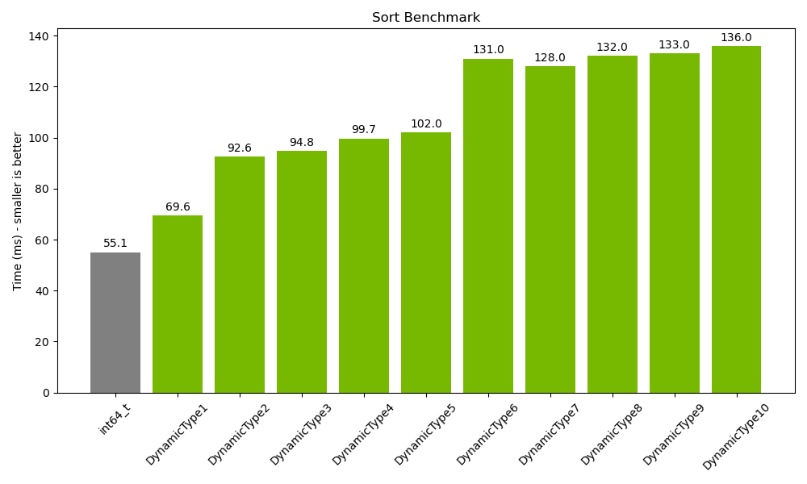
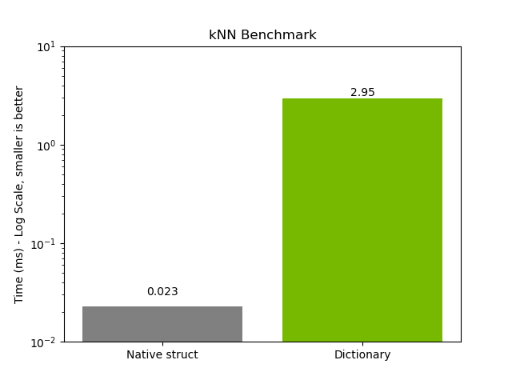
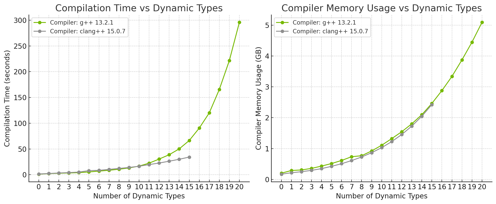

# Introduction

**dynamic_type** is a header-only C++ template library that defines `DynamicType`.

`DynamicType` is a class template that can be used to define polymorphic types.
It is similar to `std::variant`, but it is designed to be used in a way that
is more similar to how dynamic types are used in Python. For example, in Python,
you can do something like this:

```python
x = 1
y = 2.5
z = x + y
```

and `z` will be a dynamic float. However, in C++, you will not be able to do:

```C++
using IntOrFloat = std::variant<int, float>;
IntOrFloat x = 1;
IntOrFloat y = 2.5f;
IntOrFloat z = x + y;
```

because the `operator+` on `std::variant` is not defined. The goal of
`DynamicType` is to fill this gap. So you can do
(please ignore the `NoContainers` for now):

```C++
using IntOrFloat = DynamicType<NoContainers, int, float>;
IntOrFloat x = 1;
IntOrFloat y = 2.5f;
IntOrFloat z = x + y;
```

The design purpose of `DynamicType` is to allow the user to forget about the
actual type as much as possible, and use operators seamlessly just like if
they are using Python. `DynamicType` should support arbitrary types, including
user-defined types, pointers, but excluding references, due to the limitation
of the C++ standard. The definition of operators on `DynamicType` should be
automatic. For example, if you have:

```C++
struct CustomType {};
using IntOrFloatOrCustom = DynamicType<NoContainers, int, float, CustomType>;
```

Then the `operator+` on `IntOrFloatOrCustom` should be defined, and it should
be equivalent to one of the following:

- `operator+(int, int)`
- `operator+(float, float)`
- `operator+(int, float)`
- `operator+(float, int)`

depending on the actual type of the `DynamicType`. If the actual type is
`CustomType` which does not have `operator+`, or if the value is null,
then this is a runtime error. However, if have:

```C++
struct CustomType2 {};
using Custom12 = DynamicType<NoContainers, CustomType, CustomType2>;
```

Then the `operator+` on `Custom12` should not be defined at compile time,
and doing `Custom12{} + Custom12{}` results in a compilation error. It is
a compilation error because we know at compile time that none of them are
defined:

- `operator+(CustomType, CustomType)`
- `operator+(CustomType, CustomType2)`
- `operator+(CustomType2, CustomType)`
- `operator+(CustomType2, CustomType2)`

So we decided to not create the `operator+` for `Custom12`.

Also, besides requiring `operator+(T1, T2)` to be defined for some `T1` and
`T2` in the type list, it is also required that the result type of
`operator+(T1, T2)` can be used to construct the dynamic type. For example,
if you have:

```C++
struct bfloat16_zero {}; struct half_zero {};
float operator+(bfloat16_zero, half_zero) { return 0.0f; }
using BFloatOrHalfZero = DynamicType<NoContainers, bfloat16_zero, half_zero>;
```

Then the `operator+` on `BFloatOrHalfZero` should not be defined, because `BFloatOrHalfZero` can not be constructed from the result of `operator+`.
However, if you have:

```C++
using BFloatOrHalfZeroOrInt = DynamicType<NoContainers, bfloat16_zero, half_zero, int>;
```

Then the `operator+` on `BFloatOrHalfZeroOrInt` should be defined at compile time
because `int+int` is defined, but
`BFloatOrHalfZeroOrInt(half_zero{}) + BFloatOrHalfZeroOrInt(bfloat16_zero{})`
should be a runtime error because `BFloatOrHalfZeroOrInt` can not be constructed
from the result of `half_zero+bfloat16_zero`(i.e. float).

Besides the operators within `DynamicType`, such as `DynamicType + DynamicType`,
`DynamicType` also supports operators with static type. For example, if you have

```C++
IntOrFloat x = 1;
float y = 2.5f;
```

then `x + y` or `y + x` should be an `IntOrFloat` with value `3.5f`. However, if
you have

```C++
IntOrFloat x = 1;
double y = 2.5;
```

then you will get a compilation error for doing `x + y` or `y + x`, because
`int + double` and `double + int` are `double`, which can not be used to
construct `IntOrFloat`.

All the above behaviors are handled by template meta-programming, so they are
automatic. Adding a new type to the list of types does not introduce any
extra work. All the behaviors mentioned in this note are tested in
`test/examples.cpp`, so if you want to change anything in this doc, please make
sure to update the test as well.

`DynamicType` also supports recursive types, that is, the type list can
contain `DynamicType`. For example, something like:

```C++
// Warning: this code does not compile!
using IntFloatVecList = DynamicType<
    NoContainers,
    int,
    float,
    std::vector<IntFloatVecList>,
    std::list<IntFloatVecList>>;
```

However, the above code doesn't work because `IntFloatVecList` can not appear
in the definition of itself. That's why we have the "`Containers`" mechanism,
where we reserve the first argument of `DynamicType` for recursive types. The
`Containers` accepts class templates as its template arguments, such as
`Containers<Template1, Template2>`, then `Template1<Self>` and `Template2<Self>`
will be in the type list. With this mechanism, the correct way for writing
the above code is:

```C++
using IntFloatVecList = DynamicType<Containers<std::vector, std::list>, int, float>;
```

With the above definition, the value contained in `IntFloatVecList` can be
an `int`, a `float`, a `std::vector<IntFloatVecList>`, or a
`std::list<IntFloatVecList>`. For example, we can have:

```C++
IntFloatVecList x = std::vector<IntFloatVecList>{1, 2.0f};
IntFloatVecList y = std::list<IntFloatVecList>{3, x};
```

then `y` will have a structure like `{3, {1, 2.0f}}`.

`DynamicType` also has overloaded constructors for converting containers of concrete
type into a `DynamicType`, for example:

```C++
using IntFloatVec = DynamicType<Containers<std::vector>, int, float>;
IntFloatVec x = std::vector<int>{1, 2};
IntFloatVec y = std::vector<std::vector<int>>{{1, 2}, {3, 4}};
```

You can also cast from a `DynamicType` into a container of concrete types, for example:

```C++
using IntFloatVec = DynamicType<Containers<std::vector>, int, float>;
IntFloatVec x = std::vector<IntFloatVec>{1, 2.3f};
auto y = (std::vector<int>)x;
IntFloatVec z = std::vector<std::vector<IntFloatVec>>{{1, 2.3f}, {3.4f, 5}};
auto q = (std::vector<std::vector<int>>)z;
```

Also, although the name `Containers`, it is not limited to containers like `std::vector`.
It can be used to define arbitrary recursive type, such as `Containers<std::shared_ptr>`.

To check the actual type of the dynamic type, use `is<T>()`. For containers, you can just
use `is<Template>()` like `is<std::vector>()`, instead of having to fully spell it out as
`is<std::vector<IntFloatVec>>()`. Similarly, use `as<T>()` or `as<Template>()` to get the
reference or constant reference of the actual data. Also, use `type` to get the `type_info`
of the underlying data.

`DynamicType` supports subscripting. You can use `operator[]` just like using it with the
containers itself. For example:

```C++
using IntFloatVec = DynamicType<Containers<std::vector>, int, float>;
IntFloatVec x = std::vector<IntFloatVec>{1, 2.3f};
x[0] // gets IntFloatVec(1)
x[1] // gets IntFloatVec(2.3f)
```

If one of the candidate type of `DynamicType` is a struct or class, then we can use
operator `->*&` to access their members. For example:

```C++
struct A {
  int x;
  std::string name() const {
    return "A";
  }
};

struct B {
  double y;
  std::string name() const {
    return "B";
  }
};

using AB = DynamicType<NoContainers, A, B>;
AB a = A{1};
a->*&A::x // 1
(a->*&A::name)() // "A"
AB b = B{2.5};
b->*&B::y // 2.5
(b->*&B::name)() // "B"
```

`DynamicType` also supports forwarding `->*` operators, that is, if a candidate type
defines `->*`, then we calling `->*` on the `DynamicType` will just forward the `->*`
call to the candidate type. See note `[Struct Support in PolymorphicValue]` in nvFuser
for an example.

The `std::hash` for `DynamicType` is also overloaded using the `std::hash` for `std::variant`.
However, this approach has a limitation that it can not be used if there are cross-type
equality between types, because if such equality exists, two values satisfying `a == b` might
get different hash, which does not make sense.

Operations on `DynamicType` are as `constexpr` as possible. So most tests in
`DynamicTypeTest` are `static_assert` tests.

# Benchmarks

The benchmark `benchmark/sort.cpp` for running a simple `std::sort` on a vector of `int64_t`
vs vector of `DynamicType` is shown below:



The `int64_t` bar means `std::sort` on a `std::vector` of `int64_t`, and `DynamicTypeN` means
`std::sort` on a `std::vector` of a `DynamicType` with `N` different type candidates.

The benchmark `benchmark/knn.cpp` for running k-nearest-neighbor inference with and without
dynamic type is shown below:



The `Native struct` bar means structs in the algorithm are C++ native type `struct { ... };`,
and `Dictionary` means making structs in the algorithm is implemented like a dictionary,
that is, something like `DynamicType<Containers<std::unordered_map...`. The gap between native
struct and dictionary-like struct implementation is pretty large. This benchmark tells us that
dynamic structs should generally not be implemented as a dictionary. Please refer to the note
`[Struct Support in PolymorphicValue]` in nvFuser for an example on how to implement an efficient
semi-dynamic struct.

# Compilation time

The compilation time and memory usage are exponential with respect to the number of dynamic types.
Benchmarks for this are located in the `compilation-time/` directory and the result is shown below:



Note that on clang++, we can not have more than `15` dynamic types because otherwise we will hit
an error:

```C++
In file included from ../src/dynamic_type/dynamic_type.h:19:
../src/dynamic_type/type_traits.h:413:17: fatal error: instantiating fold expression with 289 arguments exceeded expression nesting limit of 256
  return (bs || ...);
         ~~~~~~~^~~~
../src/dynamic_type/type_traits.h:577:16: note: in instantiation of function template specialization 'dynamic_type::any<bool, bool, bool, bool, bool, bool, bool, bool, bool, bool, bool, bool, bool, bool, bool, bool, bool, bool, bool, bool, bool, bool, bool, bool, bool, bool, bool, bool, bool, bool, bool, bool, bool, bool, bool, bool, bool, bool, bool, bool, bool, bool, bool, bool, bool, bool, bool, bool, bool, bool, bool, bool, bool, bool, bool, bool, bool, bool, bool, bool, bool, bool, bool, bool, bool, bool, bool, bool, bool, bool, bool, bool, bool, bool, bool, bool, bool, bool, bool, bool, bool, bool, bool, bool, bool, bool, bool, bool, bool, bool, bool, bool, bool, bool, bool, bool, bool, bool, bool, bool, bool, bool, bool, bool, bool, bool, bool, bool, bool, bool, bool, bool, bool, bool, bool, bool, bool, bool, bool, bool, bool, bool, bool, bool, bool, bool, bool, bool, bool, bool, bool, bool, bool, bool, bool, bool, bool, bool, bool, bool, bool, bool, bool, bool, bool, bool, bool, bool, bool, bool, bool, bool, bool, bool, bool, bool, bool, bool, bool, bool, bool, bool, bool, bool, bool, bool, bool, bool, bool, bool, bool, bool, bool, bool, bool, bool, bool, bool, bool, bool, bool, bool, bool, bool, bool, bool, bool, bool, bool, bool, bool, bool, bool, bool, bool, bool, bool, bool, bool, bool, bool, bool, bool, bool, bool, bool, bool, bool, bool, bool, bool, bool, bool, bool, bool, bool, bool, bool, bool, bool, bool, bool, bool, bool, bool, bool, bool, bool, bool, bool, bool, bool, bool, bool, bool, bool, bool, bool, bool, bool, bool, bool, bool, bool, bool, bool, bool, bool, bool, bool, bool, bool, bool, bool, bool, bool, bool, bool, bool, bool, bool, bool, bool, bool, bool, bool, bool, bool, bool, bool, bool, bool, bool, bool, bool, bool, bool, bool, bool, bool, bool, bool, bool, bool, bool, bool, bool, bool, bool>' requested here
        return any(std::apply(f, candidates)...);
```

# Known issues

On C++20, we would have to skip containers for our SFINAE of compare operators to avoid infinite recursion in
template deduction. I believe this is a compiler bug:

- https://gcc.gnu.org/bugzilla/show_bug.cgi?id=111316
- https://gcc.gnu.org/bugzilla/show_bug.cgi?id=111504
- https://github.com/llvm/llvm-project/issues/67056

The impact of this workaround should be small if your non-container types already defines compare operators.
It should be just we would have to reject some illegal cases during runtime, where we should have rejected them during compile time.
